Calibración
=================
Esta sección muestra cómo calibrar el robot iCub y es una traducción de la [documentación del iit.](https://icub-tech-iit.github.io/documentation/icub_robot_calibration/icub-robot-calibration-v2.x/)  

Acciones preliminares:  
- Configurar la fuente de alimentación a 40V, 10A y encender el robot
- Poner el robot en la posición cero manualmente (una vez calibrado, se realizará una calibración fina para obtener un mejor resultado)


|   |   |
|---|---|
| | 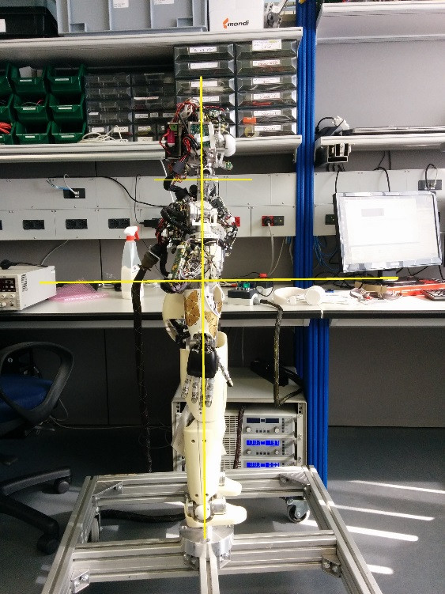|

- En el servidor YARP, correr `yarpmanager` e iniciar `icubsrv` y los clusters `pc104`: 
  
`icub@icubsrv:~$ yarpmanager`


- Conectarse con la cabeza del iCub `icub-head`: 

`icub@icubsrv:~$ ssh -X icub-head`


<a name="robotinterface"></a> 
## Correr yarprobotinterface en modo calibración
Antes se deben prender los motores del robot. Ir a la carpeta:

    cd $ROBOT_CODE/robots-configurations/iCubRobotName

(En este caso, `usr/local/src/robot/robotology-superbuild/src/robots-configuration/iCubValparaiso01`).  
Editar el archivo **general.xml** y fijar los primeros dos valores como `true`: `skipCalibration` y `UseRawEncoderData` (devolver a false al terminar de calibrar)

```xml
<?xml version="1.0" encoding="UTF-8" ?>
<!DOCTYPE params PUBLIC "-//YARP//DTD yarprobotinterface 3.0//EN" "http://www.yarp.it/DTD/yarprobotinterfaceV3.0.dtd">

<params xmlns:xi="http://www.w3.org/2001/XInclude" portprefix="icub" build="1">
  
  <group name="GENERAL">
      <param name="skipCalibration">    true </param>
      <param name="useRawEncoderData">  true  </param>
      <param name="useLimitedPWM">      false  </param>
      <param name="verbose">            false  </param>
  </group>
</params>
```

El archivo `icub_all.xml` habilita la calibración de todas las partes del robot (incluyendo la piel) - por lo tanto, se pueden comentar las partes que no van a ser calibradas. Si la piel no va a ser calibrada, comentarla y guardar en un nuevo archivo.

Así es cómo se ve el archivo `icub_all.xml`:

```xml
<?xml version="1.0" encoding="UTF-8" ?>
<!DOCTYPE robot PUBLIC "-//YARP//DTD yarprobotinterface 3.0//EN" "http://www.yarp.it/DTD/yarprobotinterfaceV3.0.dtd">

<robot name="iCubHongKong01" portprefix="icub" build="1">
    <params>
    <xi:include href="hardware/electronics/pc104.xml" />
    </params>
          
    <devices>
	
    <!-- CARTESIANS --> 
    <xi:include href="cartesian/left_arm-cartesian.xml" />
    <xi:include href="cartesian/right_arm-cartesian.xml" /> 
    
    <!-- HEAD -->
    <xi:include href="./hardware/motorControl/head-eb20-j0_1-mc.xml" />  
    <xi:include href="./hardware/motorControl/head-eb21-j2_5-mc.xml" /> 
    <xi:include href="./wrappers/motorControl/head-mc_wrapper.xml" /> 

    <!-- FACE -->
    <xi:include href="./hardware/motorControl/face-eb22-j0-mc.xml" /> 
    <xi:include href="./wrappers/motorControl/face-mc_wrapper.xml" /> 

    <!-- TORSO --> 
    <xi:include href="hardware/motorControl/torso-eb5-j0_2-mc.xml" />
    <xi:include href="wrappers/motorControl/torso-mc_wrapper.xml" /> 

    <!-- LEFT ARM -->
    <xi:include href="hardware/motorControl/left_arm-eb1-j0_3-mc.xml" />
    <xi:include href="hardware/motorControl/left_arm-eb24-j4_7-mc.xml" />
    <xi:include href="hardware/motorControl/left_arm-eb25-j8_11-mc.xml" />
    <xi:include href="hardware/motorControl/left_arm-eb26-j12_15-mc.xml" />
    <xi:include href="wrappers/motorControl/left_arm-mc_wrapper.xml" /> 

    <!-- RIGHT ARM -->
    <xi:include href="hardware/motorControl/right_arm-eb3-j0_3-mc.xml" />
    <xi:include href="hardware/motorControl/right_arm-eb27-j4_7-mc.xml" />
    <xi:include href="hardware/motorControl/right_arm-eb28-j8_11-mc.xml" />
    <xi:include href="hardware/motorControl/right_arm-eb29-j12_15-mc.xml" />
    <xi:include href="wrappers/motorControl/right_arm-mc_wrapper.xml" />

    <!-- LEFT LEG -->
    <xi:include href="hardware/motorControl/left_leg-eb6-j0_3-mc.xml" />
    <xi:include href="hardware/motorControl/left_leg-eb7-j4_5-mc.xml" />
    <xi:include href="wrappers/motorControl/left_leg-mc_wrapper.xml" /> 

    <!-- RIGHT LEG -->
    <xi:include href="hardware/motorControl/right_leg-eb8-j0_3-mc.xml" />
    <xi:include href="hardware/motorControl/right_leg-eb9-j4_5-mc.xml" />
    <xi:include href="wrappers/motorControl/right_leg-mc_wrapper.xml" />  

    <!-- INERTIAL SENSOR--> 
    <xi:include href="wrappers/inertials/head-imuFilter_wrapper.xml" />
    <xi:include href="wrappers/inertials/head-imuFilter.xml" />
    <xi:include href="wrappers/inertials/head-inertials_wrapper.xml" />
    <xi:include href="hardware/inertials/head-inertial.xml" />
    
    <!-- ANALOG SENSOR MAIS -->
    <xi:include href="wrappers/MAIS/left_arm-mais_wrapper.xml" /> 
    <xi:include href="wrappers/MAIS/right_arm-mais_wrapper.xml" /> 
    <xi:include href="hardware/MAIS/left_arm-eb26-j12_15-mais.xml" /> 
    <xi:include href="hardware/MAIS/right_arm-eb29-j12_15-mais.xml" />  
    
    <!--  SKINS  --> 
    <xi:include href="wrappers/skin/left_arm-skin_wrapper.xml" />
    <xi:include href="hardware/skin/left_arm-eb24-j4_7-skin.xml" />
    <xi:include href="wrappers/skin/right_arm-skin_wrapper.xml" />  
    <xi:include href="hardware/skin/right_arm-eb27-j4_7-skin.xml" /> 
    <xi:include href="wrappers/skin/left_leg-skin_wrapper.xml" />
    <xi:include href="wrappers/skin/right_leg-skin_wrapper.xml" />
    <xi:include href="hardware/skin/left_leg-eb10-skin.xml" />
    <xi:include href="hardware/skin/right_leg-eb11-skin.xml" />
    <xi:include href="wrappers/skin/torso-skin_wrapper.xml" />
    <xi:include href="hardware/skin/torso-eb22-skin.xml" />  
   
    <!-- ANALOG SENSOR FT -->
    <xi:include href="wrappers/FT/left_arm-FT_wrapper.xml" /> 
    <xi:include href="wrappers/FT/right_arm-FT_wrapper.xml" />
    <xi:include href="wrappers/FT/right_leg-FT_wrapper.xml" /> 
    <xi:include href="wrappers/FT/left_leg-FT_wrapper.xml" />
    <xi:include href="wrappers/FT/right_foot-FT_wrapper.xml" /> 
    <xi:include href="wrappers/FT/left_foot-FT_wrapper.xml" />
    <xi:include href="hardware/FT/left_arm-eb1-j0_3-strain.xml" /> 
    <xi:include href="hardware/FT/right_arm-eb3-j0_3-strain.xml" />
    <xi:include href="hardware/FT/left_leg-eb6-j0_3-strain.xml" /> 
    <xi:include href="hardware/FT/left_leg-eb7-j4_5-strain.xml" />
    <xi:include href="hardware/FT/right_leg-eb8-j0_3-strain.xml" /> 
    <xi:include href="hardware/FT/right_leg-eb9-j4_5-strain.xml" />   

    <!-- VIRTUAL ANALOG SENSORS (WRAPPER ONLY) -->
    <xi:include href="wrappers/VFT/left_arm-VFT_wrapper.xml" /> 
    <xi:include href="wrappers/VFT/right_leg-VFT_wrapper.xml" /> 
    <xi:include href="wrappers/VFT/left_leg-VFT_wrapper.xml" />     
    <xi:include href="wrappers/VFT/right_arm-VFT_wrapper.xml" /> 
    <xi:include href="wrappers/VFT/torso-VFT_wrapper.xml" />
    
    <!--  CALIBRATORS -->
    <xi:include href="calibrators/left_arm-calib.xml" />
    <xi:include href="calibrators/right_arm-calib.xml" /> 
    <xi:include href="calibrators/left_leg-calib.xml" />
    <xi:include href="calibrators/right_leg-calib.xml" />
    <xi:include href="calibrators/torso-calib.xml" />
    <xi:include href="calibrators/head-calib.xml" />
    <xi:include href="calibrators/face-calib.xml" />

    </devices>
</robot> 
```
Después de asegurar que `icub_all.xml` sea correcto y compilar (make install), se puede proceder con la calibración.

:warning: **Warning**  
    **PRESIONAR EL BOTÓN ROJO**  

Correr `yarprobotinterface` y esperar para la calibración del robot (presionar Enter múltiples veces).

✍️ Nota: Para calibrar distintas partes del robot (por ejemplo, para una primera inicialización), se puede crear un nuevo archivo .xml de icub_all y correrlo con el comando `yarprobotinterface --config fileName.xml`

:exclamation: **Info**     
    Después de correr `yarprobotinterface`, se verán algunos mensajes de error relacionados con el botón rojo presionado. 

## Calibración
Para la calibración de todas las partes del robot, hay un archivo `.xml` específico localizado en la carpeta `calibrators` ([ver ejemplo](https://github.com/robotology/robots-configuration/tree/master/iCubHongKong01/calibrators)). 

### Tipos de calibración
Hay diferentes tipos de calibración de articulaciones, especificados en los parámetros calibrationType:

- **type 12**: solo se necesita insertar el valor absoluto del encoder en la `posición cero`
- **type 5**: no es necesario insertar valores, se calibra automáticamente (por ejemplo, pronosupinación del brazo)
- **type 7**: es necesario insertar dos valores, `Vmax` y `Vmin` (por ejemplo, abducción de los dedos y oposición del pulgar)
- **type 6**: (dedos) es necesario insertar dos valores, `Vmax` y `Vmin`, correspondiente a los dedos cerrados (idealmente 0) y abiertos (idealmente 255)

```xml
<?xml version="1.0" encoding="UTF-8" ?>
<!DOCTYPE devices PUBLIC "-//YARP//DTD yarprobotinterface 3.0//EN" "http://www.yarp.it/DTD/yarprobotinterfaceV3.0.dtd">


	<device xmlns:xi="http://www.w3.org/2001/XInclude" name="left_arm-calibrator" type="parametricCalibratorEth">
                <xi:include href="../general.xml" />

		<group name="GENERAL">
		    <param name="joints">16</param> <!-- the number of joints of the robot part -->
		    <param name="deviceName"> Left_Arm_Calibrator </param>
		</group>
		<!-- joint logical number                     0           1         2           3           4      5     6     7     8     9    10    11    12     13     14    15 -->
		<group name="HOME">
			<param name="positionHome">           -30        30         0          45           0     0      0    35    65     0     0     0     0      0      0     0  </param>
			<param name="velocityHome">           10         10         10         10           30    30     30   60    30    30    30    30    30     30     30    30  </param>
		</group>                                                                        
				                                                                
		<group name="CALIBRATION">                                                      
			<param name="calibrationType">        12         12         12         12           5      12     12    7     7     6     6     6     6      6      6     6     </param>
			<param name="calibration1">           12895   	 19391      57775      50843       -1500   28767  13823 0     0     0     0     0     0      0      0     0     </param>
			<param name="calibration2">	      0          0          0          0	    16384  0      0     0     0     9102  9102  9102  9102   9102   9102  3640  </param>
			<param name="calibration3">           0          0          0          0	    0      0      0     0     0    -1     1    -1     1     -1      1    -1     </param>
			<param name="calibration4">           0          0          0          0            0      0      0     2520  471   255   510   255   510    255    510   765   </param>
			<param name="calibration5">           0          0          0          0            0      0      0     3030  3436  26    5     26    55     5     20    164   </param>
			<param name="calibrationZero">        0          0          0          0            0      0      0     0     0     0     0     0     0      0      0     0     </param>
			<param name="calibrationDelta">       1.4       -5.7       -10        -3.5          0      4.7   -3.5   0     0     0     0     0     0     0      0      0     </param>
						                                                        
			<param name="startupPosition">       -35         30         0          50           0      0      0     15    30    0     0     0     0      0      0     0     </param>
			<param name="startupVelocity">        10         10         10         10           30     30     30    100   100   100   100   100   100    100    100   100   </param>
			<param name="startupMaxPwm">          2000       2000       2000       2000         2000   0      0     0     0     0     0     0     0      0      0     0     </param>
			<param name="startupPosThreshold">    2          2          2          2            90     90     90    90    90    90    90    90    90     90     90    90    </param>
		</group>

		<param name="CALIB_ORDER">(0 1 2 3) (4) (5 6 7) (8 9 11 13) (10 12 14 15) </param> 

		<action phase="startup" level="10" type="calibrate">
		    <param name="target">left_arm-mc_wrapper</param>
		</action>

		<action phase="interrupt1" level="1" type="park">
		    <param name="target">left_arm-mc_wrapper</param>
		</action>

		<action phase="interrupt3" level="1" type="abort" />

	</device>
```
- En el server hte/laptop correr `yarpmotorgui` para comprobar las lecturas de las articulaciones hechas por el encoder


<a name="calib-cabeza"></a> 
### Calibración de cabeza (solo V2)
Abrir el [archivo de calibración](https://github.com/robotology/robots-configuration/blob/master/iCubHongKong01/calibrators/head-calib.xml) y poner los valores leídos desde el `yarpmotorgui` para las `articulaciones 0,1,2,3` en el `<param name="calibration1">` dentro de `<group name="CALIBRATION">`.

:exclamation: **Info** 
    Los parámetros de articulaciones en los archivos `xml` se organizan como:
    `Column 1 = Joint 0` ... `Column n = Joint n-1`.

```xml
 <group name="CALIBRATION">
        <param name="calibrationType">      12         12          12          12           5           5           </param>
        <param name="calibration1">   	    30600	31535       46239        6687	     3000        3000	        </param>
        <param name="calibration2">         0           0           0	        0        8192   	 8192           </param>
        <param name="calibration3">	        0	        0           0	        0	        0    	    0           </param> 
        <param name="calibration4">         0           0           0           0           0           0           </param>
        <param name="calibration5">         0           0           0           0           0           0           </param>                
        <param name="calibrationZero">      0           0           0           0           0           0           </param>
        <param name="calibrationDelta">     0           0           0           0           0           0           </param> 
      
        <param name="startupPosition">      0           0           0           0           0           0           </param>        
        <param name="startupVelocity">      10          10          20          20          20          20          </param>        
        <param name="startupMaxPwm">        3000        3000        3000        3000        0           0           </param>        
        <param name="startupPosThreshold">  90          90          2           2           2           2           </param>        
        </group> 
```

:warning: **Warning**  
    Tener cuidado de que el parámetro`<param name="calibrationDelta"> ` tenga todos los valores establecidos en 0.

<a name="calib-torso"></a> 
### Torso
Abrir el [archivo de calibración](https://github.com/robotology/robots-configuration/blob/master/iCubHongKong01/calibrators/torso-calib.xml) y poner los valores leídos desde el `yarpmotorgui` para las `articulaciones 0,1,2` en el `<param name="calibration1">` dentro de `<group name="CALIBRATION">`.

:exclamation: **Info** 
    Los parámetros de articulaciones en los archivos `xml` se organizan como:
    `Column 1 = Joint 0` ... `Column n = Joint n-1`.

```xml
 <group name="CALIBRATION">
		<param name="calibrationType">                    12                     12                        12       </param>
		<param name="calibration1">                       1535                11951                     36671       </param> 
		<param name="calibration2">                       0                       0                         0       </param> 
		<param name="calibration3">                       0                       0                         0       </param> 
		<param name="calibration4">                       0                       0                         0       </param>
		<param name="calibration5">                       0                       0                         0       </param>
		<param name="calibrationZero">                    0                       0                         0       </param>
		<param name="calibrationDelta">                   0                       0                         0       </param>

		<param name="startupPosition">                    0                       0                         0       </param>
		<param name="startupVelocity">                    10                      10                        10      </param>
		<param name="startupMaxPwm">                      5500                    5500                      5500    </param>
		<param name="startupPosThreshold">                2                       2                         2       </param>
 </group>
```

:warning: **Warning**  
    Tener cuidado de que el parámetro `<param name="calibrationDelta"> ` tenga todos los valores establecidos en 0.

<a name="calib-brazos"></a> 
## Calibración de brazos 
Abrir el [archivo de calibración brazo izquierdo](https://github.com/robotology/robots-configuration/blob/master/iCubHongKong01/calibrators/left_arm-calib.xml) o [archivo de calibración brazo derecho](https://github.com/robotology/robots-configuration/blob/master/iCubHongKong01/calibrators/right_arm-calib.xml) y poner los valores leídos desde el `yarpmotorgui` para las `articulaciones 0,1,2,3` en el parámetro `<param name="calibration1">` dentro de `<group name="CALIBRATION">`.

:exclamation: **Info** 
    Los parámetros de articulaciones en los archivos `xml` se organizan como:
    `Column 1 = Joint 0` ... `Column n = Joint n-1`.

```xml
 <group name="CALIBRATION">                                                      
			<param name="calibrationType">         12        12         12         12        5      12     12      7     7     6     6     6     6      6      6     6     </param>
			<param name="calibration1">         12895     19391      57775      50843     -1500  28767  13823      0     0     0     0     0     0      0      0     0     </param>
			<param name="calibration2">	            0         0          0          0	  16384      0      0      0     0  9102  9102  9102  9102   9102   9102  3640  </param>
			<param name="calibration3">             0         0          0          0	      0      0      0      0     0    -1     1    -1     1     -1      1    -1     </param>
			<param name="calibration4">             0         0          0          0         0      0      0   2520   471   255   510   255   510    255    510   765   </param>
			<param name="calibration5">             0         0          0          0         0      0      0   3030  3436    26     5    26    55     5     20    164   </param>
			<param name="calibrationZero">          0         0          0          0         0      0      0     0      0     0     0     0     0     0      0      0     </param>
			<param name="calibrationDelta">         0         0          0          0         0      0      0     0      0     0     0     0     0     0      0      0     </param>
						                                                        
			<param name="startupPosition">        -35        30          0         50         0      0      0    15     30     0     0     0     0      0      0     0     </param>
			<param name="startupVelocity">         10        10         10         10        30     30     30   100    100   100   100   100   100    100    100   100   </param>
			<param name="startupMaxPwm">         2000      2000       2000       2000      2000      0      0     0      0     0     0     0     0      0      0     0     </param>
			<param name="startupPosThreshold">      2         2          2          2        90     90     90    90     90    90    90    90    90     90     90    90    </param>
		</group>
```

:warning: **Warning**  
    Tener cuidado de que el parámetro `<param name="calibrationDelta"> ` tenga todos los valores establecidos en 0.

<a name="calib-muñeca"></a> 
## Calibración de muñeca
Posicionar la muñeca en la `posición cero`:

|   |   |
|---|---|
| | |

Abrir el [archivo de calibración brazo izquierdo](https://github.com/robotology/robots-configuration/blob/master/iCubHongKong01/calibrators/left_arm-calib.xml) o [archivo de calibración brazo derecho](https://github.com/robotology/robots-configuration/blob/master/iCubHongKong01/calibrators/right_arm-calib.xml) y poner los valores leídos desde el `yarpmotorgui` para las `articulaciones 5,6` en el parámetro `<param name="calibration1">` dentro de`<group name="CALIBRATION">`.

:exclamation: **Info** 
    Los parámetros de articulaciones en los archivos `xml` se organizan como:
    `Column 1 = Joint 0` ... `Column n = Joint n-1`.

```xml
 <group name="CALIBRATION">                                                      
			<param name="calibrationType">         12        12         12         12        5      12     12      7     7     6     6     6     6      6      6     6     </param>
			<param name="calibration1">         12895     19391      57775      50843     -1500  28767  13823      0     0     0     0     0     0      0      0     0     </param>
			<param name="calibration2">	            0         0          0          0	  16384      0      0      0     0  9102  9102  9102  9102   9102   9102  3640  </param>
			<param name="calibration3">             0         0          0          0	      0      0      0      0     0    -1     1    -1     1     -1      1    -1     </param>
			<param name="calibration4">             0         0          0          0         0      0      0   2520   471   255   510   255   510    255    510   765   </param>
			<param name="calibration5">             0         0          0          0         0      0      0   3030  3436    26     5    26    55     5     20    164   </param>
			<param name="calibrationZero">          0         0          0          0         0      0      0     0      0     0     0     0     0     0      0      0     </param>
			<param name="calibrationDelta">         0         0          0          0         0      0      0     0      0     0     0     0     0     0      0      0     </param>
						                                                        
			<param name="startupPosition">        -35        30          0         50         0      0      0    15     30     0     0     0     0      0      0     0     </param>
			<param name="startupVelocity">         10        10         10         10        30     30     30   100    100   100   100   100   100    100    100   100   </param>
			<param name="startupMaxPwm">         2000      2000       2000       2000      2000      0      0     0      0     0     0     0     0      0      0     0     </param>
			<param name="startupPosThreshold">      2         2          2          2        90     90     90    90     90    90    90    90    90     90     90    90    </param>
		</group>
```

:warning: **Warning**  
    Tener cuidado de que el parámetro `<param name="calibrationDelta"> ` tenga todos los valores establecidos en 0.

<a name="calib-manos"></a> 
## Calibración de manos
Con referencia a la tabla a continuación, con ayuda de un destornillador, lea los valores `Min` and `Max`:

|Parte|Articulación#|Motor|Min|Max|
|---|---|---|---|---|
|Abducción de los dedos|7|->|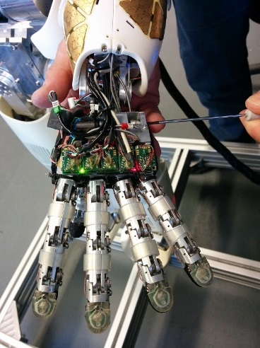 | |
|Abducción del pulgar|8|->| | |
|Pulgar proximal|9|| | |
|Pulgar distal|10|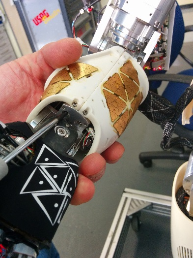| | |
|Dedo índice proximal|11|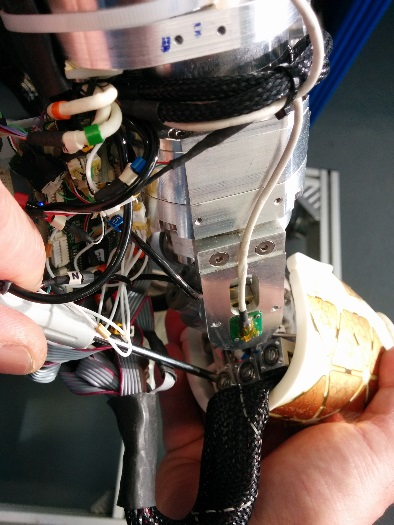| | |
|Dedo índice distal|12|| | |
|Dedo medio proximal|13|| | 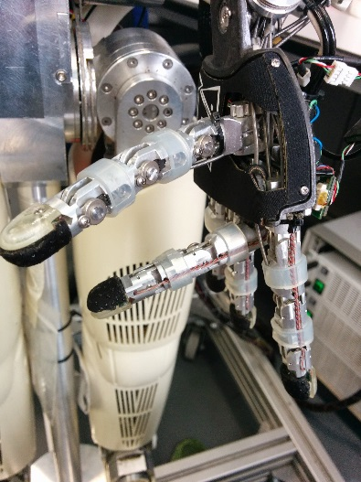|
|Dedo medio distal|14|| | 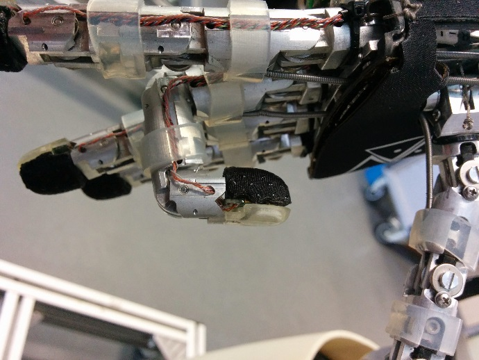|
|Dedo anular y meñique|15|| | |


:warning: **Warning**  
    Tener cuidado de que los valores sean leídos respecto a la relación:`Min` < `Max`s
    De otra forma, se tendrá que mover el imán hasta alcanzar la situación indicada.

Abrir el [archivo de calibración brazo izquierdo](https://github.com/robotology/robots-configuration/blob/master/iCubHongKong01/calibrators/left_arm-calib.xml) o [archivo de calibración brazo derecho](https://github.com/robotology/robots-configuration/blob/master/iCubHongKong01/calibrators/right_arm-calib.xml) y poner los valores `Min` y `Max` leídos desde el `yarpmotorgui` respecticamente en el paŕametro `<param name="calibration4">` y el paŕametro `<param name="calibration5">` dentro de `<group name="CALIBRATION">` para cada articulación en la tabla  de arriba.

:exclamation: **Info**  
    Los parámetros de articulaciones en los archivos `xml` se organizan como:
    `Column 1 = Joint 0` ... `Column n = Joint n-1`.

```xml
<group name="CALIBRATION">                                                      
			<param name="calibrationType">         12        12         12         12        5      12     12      7     7     6     6     6     6      6      6     6     </param>
			<param name="calibration1">         12895     19391      57775      50843     -1500  28767  13823      0     0     0     0     0     0      0      0     0     </param>
			<param name="calibration2">	            0         0          0          0	  16384      0      0      0     0  9102  9102  9102  9102   9102   9102  3640  </param>
			<param name="calibration3">             0         0          0          0	      0      0      0      0     0    -1     1    -1     1     -1      1    -1     </param>
			<param name="calibration4">             0         0          0          0         0      0      0   2520   471   255   510   255   510    255    510   765   </param>
			<param name="calibration5">             0         0          0          0         0      0      0   3030  3436    26     5    26    55     5     20    164   </param>
			<param name="calibrationZero">          0         0          0          0         0      0      0     0      0     0     0     0     0     0      0      0     </param>
			<param name="calibrationDelta">         0         0          0          0         0      0      0     0      0     0     0     0     0     0      0      0     </param>
						                                                        
			<param name="startupPosition">        -35        30          0         50         0      0      0    15     30     0     0     0     0      0      0     0     </param>
			<param name="startupVelocity">         10        10         10         10        30     30     30   100    100   100   100   100   100    100    100   100   </param>
			<param name="startupMaxPwm">         2000      2000       2000       2000      2000      0      0     0      0     0     0     0     0      0      0     0     </param>
			<param name="startupPosThreshold">      2         2          2          2        90     90     90    90     90    90    90    90    90     90     90    90    </param>
</group>
```

:warning: **Warning**  
    Tener cuidado de que el parámetro `<param name="calibrationDelta"> ` tenga todos los valores establecidos en 0.

<a name="calib-piernas"></a> 
## Calibración de piernas 
Abrir el [archivo de calibración pierna izquierda](https://github.com/robotology/robots-configuration/blob/master/iCubHongKong01/calibrators/left_leg-calib.xml) o [archivo de calibración pierna derecha](https://github.com/robotology/robots-configuration/blob/master/iCubHongKong01/calibrators/right_leg-calib.xml) y poner los valores leídos desde el `yarpmotorgui` para las `articulaciones 0,1,2,3,4,5` en el parámetro `<param name="calibration1">` dentro de `<group name="CALIBRATION">`.

:exclamation: **Info**  
    Los parámetros de articulaciones en los archivos `xml` se organizan como:
    `Column 1 = Joint 0` ... `Column n = Joint n-1`.

```xml
<group name="CALIBRATION">
    <param name="calibrationType">           12        12         12        12      12      12        </param>
    <param name="calibration1">              223      6239      57663      36031   63375   63535      </param> 
    <param name="calibration2">              0         0          0         0       0       0         </param> 
    <param name="calibration3">              0         0          0         0       0       0         </param> 
                                                                
    <param name="calibration4">              0         0          0         0       0       0         </param>
    <param name="calibration5">              0         0          0         0       0       0         </param>
    <param name="calibrationZero">           0         0          0         0       0       0         </param>
    <param name="calibrationDelta">          0         0          0         0       0       0         </param>


    <param name="startupPosition">           0         5          0         0       0       0         </param>
    <param name="startupVelocity">           5         5          10        10      10      10        </param>
    <param name="startupMaxPwm">             1200      1200       1200      1200    1500    1500      </param>
    <param name="startupPosThreshold">       2         2          2         2       2       2         </param>
</group>
```

:warning: **Warning**  
    Tener cuidado de que el parámetro `<param name="calibrationDelta"> ` tenga todos los valores establecidos en 0.

<a name="calib-brazosp"></a> 
## Calibración precisa de los brazos
Aquí se describe cómo corregir errores pequeños en la calibración del iCub. Aplica principalmente a las articulaciones del hombro y del codo (joint0...joint3) pero también puede ser utilizado para las otras articulaciones del brazo.

:exclamation: **Info** 
    Este procedimiento debe ser hecho después de la calibración del torso.

Poner el iCub  en una postura adecuada y considerar esta configuración como la deseada `theta_desired` de acuerdo a la convención que se decidió utilizar. Como ejemplo, si se decide usar la convención descrita en [ICubForwardKinematics](./icub-forward-kinematics/icub-forward-kinematics.md), es posible que se decida usar la postura en las imágenes que corresponde a `theta_desired = [-90 15 15 90] [deg]` (recordar que solo se están considerando tres grados de libertad del hombro y el codo, se da un ejemplo en las imágenes de abajo).

|   |   |   |
|---|---|---|
| | ||

El onjetivo es insertar los deltas de calibración `<param name="calibrationDelta">` en cada archivo utilizando la fórmula: `Delta = Theta - Theta_Desired`.

<a name="calib-ojos"></a> 
## Calibración de los ojos
El mecanismo de los ojos tiene un total de tres grados de libertad. Ambos ojos pueden inclinarse  (independientemente) y desplazarse (simultáneamente).

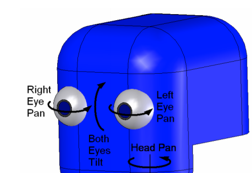

Por ende, las tres articulaciones a calibrar son: versión del ojo (movimiento izquierda-derecha), vergencia del ojo (dentro-fuera) e inclinación del ojo (arriba-abajo).

Mientras que el desplazamiento puede ser calibrado insertando directamente el valor del delta en el archivo de calibración, la versión y la vergencia necesitan ser calibradas de la siguiente manera:

`Joint 4 (versión): delta = |delta_j4| + |delta_j5|`

`Joint 5 (vergencia): delta = |delta_j4| - |delta_j5|`

con el signo escogido acordemente.

<a name="calib-camaras"></a> 
## Calibración de las cámaras
### Obtener GUID de la cámara
Abrir un terminal en la icub-head y escribir:

```xml
  icub@icub-head:~$ yarpdev --device grabberDual --subdevice dragonfly2 --name /cam0 --d 0 --allow-deprecated-devices
```

y se obtendrá la información

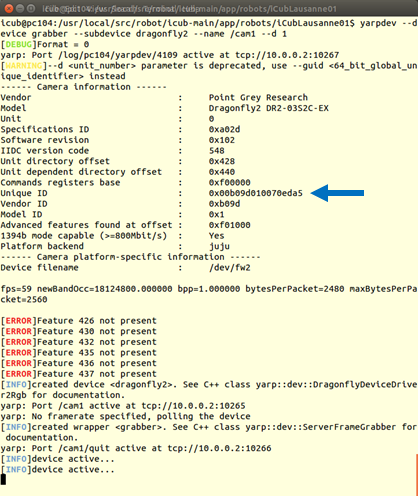

Ahora, abrir un terminal en el servidor y escribir:

```xml
  icub@icubsrv:~$ yarpview --name /view0
  icub@icubsrv:~$ yarp connect /cam0 /view0
```

Corroborar cuál cámara está funcionando y luego poner el “ID único” en los archivos respectivos en

```xml
$ROBOT_CODE/robots-configuration/<$YARP_ROBOT_NAME>/camera
```

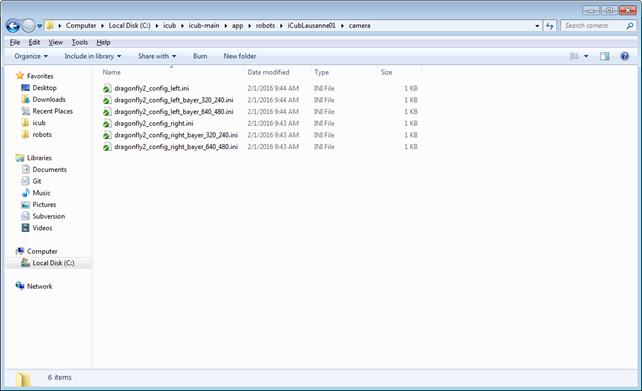

Hacer todos los pasos de arriba nuevamente para la otra cámara, cambiando el parámetro `--d 0` a `--d 1` en el primer comando.


### Calibrando cámaras
Ahora es necesario asegurarse de que las dos cámaras están perfectamente alineadas entre ellas. Para lograr esto, mostrar una cruz negra al robot a una distancia específica (ver imagen) y ajustar las cámaras hasta que alcancen la correcta alineación.

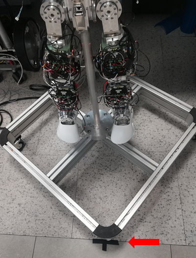

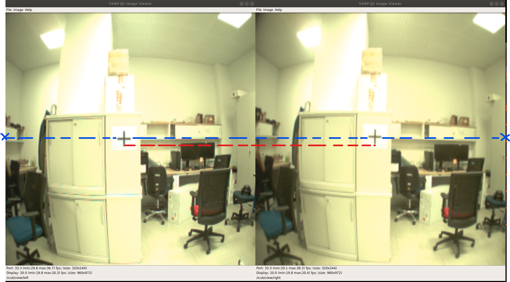

- Correr `yarprobotinterface` y esperar para la calibración del robot.

- Correr `yarpmanager`, abrir la entidad `Cameras` y luego correr ambos módulos `yarpdev` y conectar.

- Abrir y correr SOLO los dos módulos yarpview y conectar.

- En un terminal, en el servidor escribir:

```xml
$ stereoCalib --from icubEyes.ini

```

:warning: **Warning**  
    NO ABRIR la aplicación StereoCalibration directamente desde yarpmanager, de otra forma no será posible ver el resultado del proceso de calibración.

- Luego escribir:

```xml
$ yarp rpc /stereoCalibration/cmd
```

Luego escribir “start”, un mensaje “Starting Calibration…” aparecerá.

Ahora, mostrar el tablero al robot teniendo cuidado de moverlo con una inclinación diferente para cada adquisición (30 en total). Quedarse quieto y simplemente mover el tablero de ajedrez. El tablero debe caber en toda la pantalla y estar en vista horizontal. El sistema solo adquiere datos si las líneas de colores aparecen sobre el tablero de ajedrez.

En el terminal del stereoCalib debería verse:

```xml 
  Running Left Camera Calibration... 
  RMS error reported by calibrateCamera: 0.592978  
  Running Right Camera Calibration... 
  RMS error reported by calibrateCamera: 0.147403
  30 pairs have been successfully detected.
  Running stereo calibration ...
  done with RMS error= 0.717102
  average reprojection err = 0.958607
  Saving Calibration Results... 
```

:exclamation: **Info**  
    Para obtener buenos parámetros se deberían ver errores menores a 1.

❗ Después de la calibración, es necesario copiar MANUALMENTE los datos dentro del archivo iCubEyes.ini

📚 Para información adicional, ver [aquí](./icub-stereo-calib.md).
