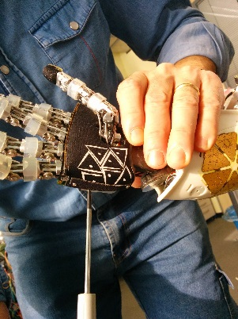

Manual de usuario
==========================
iCub es un robot diseñado para investigación colaborativa en desarrollo cognitivo a través de exploración autónoma, interacción social y con su entorno. Su carácter Open Source permite compartir desarrollos con los otros laboratorios de la red, así como reutilizar avances realizados previamente en otro lugar del mundo, y su capacidad de expresar gestos faciales permite además realizar experiencias de interacción con personas, niños, etc.

Fuente: Dirección General de Comunicaciones USM

<p align="center">
  
</p>

Inicialmente, se recomienda mirar la documentación con los [tutoriales del iCub](#iCub), pasando primero por los de YARP y luego los que correspondan al iCub en específico. Luego de estudiar la documentación disponible, pasar a la instalación de las herramientas de trabajo a utilizar.


Tabla de Contenidos
=================
  * [Linux](#instalar-linux)
  * [YARP](#instalar-yarp)
  	* [Robotology superbuild](#robotology-superbuild)
  * [Tutoriales](#tutoriales)
  * [iCub](#iCub)
  	* [Trabajando con puertos en YARP](#Trabajando-con-puertos-en-Yarp)
  	* [Puertos especializados RPC](#puertos-especializados-rpc)
  	* [Clase RFModule](#Clase-RFModule)
  * [Calibración](#calibración)
  	* [Yarprobotinterface](#robotinterface)
  	* [Torso](#calib-torso)
  	* [Brazos](#calib-brazos)
  	* [Muñeca](#calib-muñeca)
  	* [Manos](#calib-manos)
  	* [Piernas](#calib-piernas)
  	* [Brazos (precisa)](#calib-brazosp)
  	* [Ojos](#calib-ojos)
  	* [Cámaras](#calib-camaras)

Linux
=================
Linux es el nombre que reciben una serie de sistemas operativos de tipo Unix bajo la licencia GNU GPL (General Public License o Licencia Pública General de GNU) que son su mayoría gratuitos y con todo lo necesario para hacer funcionar un PC, con la peculiaridad de es posible instalar un sistema muy ligero e ir añadiendo todo lo necesario posteriormente o según vaya siendo necesario.

Es posible trabajar con YARP en todos los sistemas operativos, pero es muy recomendable instalar Linux ya que fue desarrollado para este. Es posible instalarlo tanto con el uso de una máquina virtual como mediante una partición de disco duro.

Instalar Linux
=================

Una partición es el nombre que se le da a cada división presente en una sola unidad física de almacenamiento de datos. Para que se entienda, tener varias particiones es como tener varios discos duros en un solo disco duro físico, cada uno con su sistema de archivos y funcionando de manera diferente. Para instalar Linux sin perder Windows en un computador, es necesario hacer esto. Para acceder a esta opción basta con presionar las teclas Windows+R e ingresar el comando
  
```
diskmgmt.msc
```
Teniendo la partición creada, hacer los siguientes pasos:  

1. Ir a https://ubuntu.com/download (o la distribución de su preferencia) y descargar el archivo .iso

2. Descargar Rufus (el ejecutable se encuentra en los archivos del repositorio. Para descargar una versión más actual ir a https://rufus.ie/es/).

3. Cargar el archivo iso de Ubuntu a Rufus y subirlo a un pendrive para bootearlo.  

Una forma de instalar Linux sin hacer una partición de disco duro es utilizando una máquina virtual. El siguiente enlace muestra varias implementaciones de estas: https://hipertextual.com/2017/07/instala-ubuntu-windows-maquina-virtual


Instalar yarp
=================
YARP es un paquete de software de código abierto escrito en C++ que se utiliza para interconectar sensores, procesadores y actuadores en el iCub. Para su instalación se utilizará robotology superbuild.
## Robotology superbuild
Este es un repositorio que utiliza CMake y YCM para descargar y compilar automáticamente software desarrollado en la organización de robotology GitHub, como el software intermedio YARP o el software utilizado para ejecutar el robot iCub.

CMake es una familia de herramientas multiplataforma de código abierto diseñada para crear, probar y empaquetar software. Un YCM Superbuild es un proyecto de CMake cuyo único objetivo es descargar y compilar varios otros proyectos. Se puede leer más sobre el concepto de superbuild en la documentación de YCM o en el documento de IRC relacionado.
1. Instalación git  
Para esto se espera primero la creación y verificación de una cuenta en GitHub ya que es una herramienta útil, tanto para trabajar con los repositorios de robotology como para otras fuentes útiles.
Luego de esto, se instala git a través de la terminal con el siguiente comando:

```
sudo apt install git
```

Junto con esto, se debe ejecutar en terminal lo siguiente:


```
sudo apt-get install build-essential cmake cmake-curses-gui coinor-libipopt-dev
freeglut3-dev git libace-dev libboost-filesystem-dev libboost-system-dev libboost-
thread-dev libdc1394-22-dev libedit-dev libeigen3-dev libgsl0-dev libjpeg-dev
liblua5.1-dev libode-dev libopencv-dev libsdl1.2-dev libtinyxml-dev libv4l-dev
libxml2-dev lua5.1 portaudio19-dev qml-module-qt-labs-folderlistmodel qml-module-qt-
labs-settings qml-module-qtmultimedia qml-module-qtquick-controls qml-module-qtquick-
dialogs qml-module-qtquick-window2 qml-module-qtquick2 qtbase5-dev qtdeclarative5-dev
qtmultimedia5-dev swig libmatio-dev
```

:warning: **NOTA**: Si esto no se ejecuta correctamente, se propone una [solución alternativa.](#item1)

2. Verificación cuenta git

En este paso se debe ejecutar los siguientes comandos en la terminal:

```
git config --global user.name NombreUsuario (Reemplazar NombreUsuario por usuario creado en GitHub)
git condig --global user.email usuario@email.com (Reemplazar usuario@email.com por correo GitHub)
```

Para verificar el usuario y correo se ejecuta el siguiente comando:
```
sudo gedit ~/.gitconfig
```

3. Instalación Robotology

Para instalar las herramientas de YARP  y ICUB, lo primero que se debe hacer es clonar el repositorio de robotology

```
git clone https://github.com/robotology/robotology-superbuild
```
<a name="item1"></a> 
- **Solución alternativa** al punto 1: Luego de clonar el repositorio, se debe ejecutar lo siguiente
	
```
	cd robotology-superbuild
	sudo bash ./scripts/install_apt_dependencies.sh
```
Luego, se debe ir a la carpeta robotology-superbuild y ejecutar el comando:

```
mkdir build
cd build
ccmake ../
```

El comando "ccmake ../" abrirá un apartado en el terminal que se debe setear, por lo que si se abre una pestaña vacía, primero se debe configurar con la tecla c. La configuración seteará por defecto algunos apartados en :heavy_check_mark:**ON** y otros en :x:**OFF**. 


Se recomienda dejar esta configuración y dejar en :heavy_check_mark:**ON** lo relacionado a YARP, ICUB o GAZEBO.


4. Configuración de entorno

Para setear la configuración hecha en el paso anterior se debe usar el siguiente comando:

```
source <directory-where-you-downloaded-robotology-superbuild>/build/install/share/robotology-superbuild/setup.sh
```

Y luego se debe actualizar `/setup.sh` con el archivo `.bashrc` mediante el comando:

```
source ~/.bashrc
```

5. Confirmación de instalación

Para asegurarnos de que la instalación se ha efectuado correctamente se propone probar 3 comandos importantes:

- Se revisa el servidor:
	
```
yarpserver
```
	
- Se revisa el entorno de simulación del iCub:

```
iCub_SIM
```

- Se revisa la conexión con los puertos a las articulaciones del robot

```
yarpmotorgui --robot icubSim	
```

:mag: **Para más referencias sobre instalación:**

* [Tutorial instalación 1](https://www.youtube.com/watch?v=4g5i_q1etck&t=20s)
* [Tutorial instalación 2](https://www.youtube.com/watch?v=Q0ppqigyCPI&t=2s)
* [Repositorio Robotology](https://github.com/robotology/robotology-superbuild)


 
Tutoriales
=================
Para trabajo con múltiples terminales, se recomienda instalar el terminal **terminator** con fin de facilitar la visualización de cada uno. Para esto, abrir un terminar y escribir:
```
sudo add-apt-repository ppa:gnome-terminator
sudo apt-get update
sudo apt-get install terminator
```
Introducción a YARP  
:hammer: [Producer-consumer](https://github.com/vvv-school/tutorial_yarp-producer-consumer)  
:hammer: [YARP basics](https://github.com/vvv-school/tutorial_yarp-basics)  
:hammer: [YARP manager](https://github.com/vvv-school/tutorial_yarpmanager)  
:hammer: [RF Module](https://github.com/vvv-school/tutorial_RFModule-simple)  

Realizando estos tutoriales iniciales, ya se cuenta con los conocimientos suficientes para realizar la primera tarea  
:medal_military: [Find RGB](https://github.com/vvv-school/assignment_yarp-find-rgb)

Robot control  
:hammer: [Joint interface](https://github.com/vvv-school/tutorial_joint-interface)  
:hammer: [Cartesian interface](https://github.com/vvv-school/tutorial_cartesian-interface)  
:hammer: [Gaze interface](https://github.com/vvv-school/tutorial_gaze-interface)  
:warning: NO correr iCub_SIM y Gazebo al mismo tiempo. 

A esta altura, ya se debería ser experto en las 3 interfaces principales utilizadas por el iCub, por lo que se proponen las siguientes tareas:  

:medal_military: [Make it roll](https://github.com/vvv-school/assignment_make-it-roll)  
:medal_military:[Grasp it](https://github.com/vvv-school/assignment_grasp-it)

iCub
=================

El iCub se trabaja nativamente en C++, haciendo uso de las herramientas entregadas por el sistema de control y comunicación de YARP. Por esto, se recomienda leer la [documentación](https://www.yarp.it/latest/index.html) y revisar los [tutoriales](https://robotology.github.io/robotology-documentation/doc/html/icub_tutorials.html) disponibles.

En esta sección se procederá a explicar los tutoriales disponibles como forma de abordarlos de manera sencilla.

## Trabajando con puertos en YARP

La comunicación en YARP se resuelve siguiente un patrón de diseño del observador o puerto. Estos **puertos especiales** llevan mensajes a cualquier número de observadores (otros puertos), en cualquier número de procesos, distribuido a través de cualquier número de máquinas, mediante cualquiera de los protocolos de comunicación soportados.


Aquí un ejemplo de una red de puertos YARP:

<p align="center">
  
</p>


Todos los puertos pertenecen a un proceso, pero no necesariamente al mismo. Además, pueden coexistir diversos protocolos de comunicación y/o redes físicas.

Características por protocolo:

* TCP → Confiable. Garantía de recepción de un mensaje.
* UDP → Más rápido que TCP pero sin garantías.
* musticast → Eficiente para transmisión de un mismo mensaje a múltiples objetivos.
* Shared memory → Usado en conexiones locales (No es necesario intervención de programación para hacer las conexionesr). Usado para monitoreo, es fácil de traducir a texto simple.

### Ejemplo de trabajo

Para poder inicializarse en el trabajo con los puertos de comunicación mediante YARP se propone el siguiente ejemplo.

El primer paso es :warning:**IMPORTANTE** debido a que cada trabajo a desarrollarse, tanto en simulación como en el robot físico, es importante tener inicializado el servidor de YARP.

Para esto, se corre el siguiente comando:

```
[en terminal 1] yarpserver
```

Siguiendo con el ejemplo, en un segundo terminal se abre un puerto de lectura:

```
[en terminal 2] yarp read /read
```

El nombre del puerto siempre será con la sintaxis ```/NombrePuerto``` y este puede ser cualquiera, sin embargo, se recomienda que se le asigne un nombre relacionado con su funcionalidad.

En un tercer terminal se abre un puerto de escritura:

```
[en terminal 3] yarp write /write
```

En un cuarto terminal se ejecuta el siguiente comando de conexión:

```
[en terminal 4] yarp connect /write /read
```

Aquí hacemos referencia a los puertos por sus nombres, incluyendo el caracter ```/```


La conexión se vería de la siguiente forma:

<p align="center">
  
</p>


Ahora, se implementará un código que interactúa con estos puertos, añadiendo números al puerto de lectura.


```c++
/*
 * SPDX-FileCopyrightText: 2006-2021 Istituto Italiano di Tecnologia (IIT)
 * SPDX-FileCopyrightText: 2006-2010 RobotCub Consortium
 * SPDX-License-Identifier: BSD-3-Clause
 */
 
#include <yarp/os/Bottle.h>
#include <yarp/os/BufferedPort.h>
#include <yarp/os/LogStream.h>
#include <yarp/os/Network.h>
 
#include <iostream>
 
using yarp::os::Bottle;
using yarp::os::BufferedPort;
using yarp::os::Network;
 
int main(int argc, char* argv[])
{
    YARP_UNUSED(argc);
    YARP_UNUSED(argv);
 
    Network yarp;
    BufferedPort<Bottle> port;
    port.open("/summer");
    while (true) {
        yInfo() << "waiting for input";
        Bottle* input = port.read();
        if (input != nullptr) {
            yInfo() << "got " << input->toString().c_str();
            double total = 0;
            for (size_t i = 0; i < input->size(); i++) {
                total += input->get(i).asFloat64();
            }
            Bottle& output = port.prepare();
            output.clear();
            output.addString("total");
            output.addFloat64(total);
            yInfo() << "writing " << output.toString().c_str();
            port.write();
        }
    }
    return 0;
}
```

Para compilar y ejecutar este programa debemos crear un archivo ```makefile```. Este archivo variará en contenido dependiendo de las necesidades y requerimientos del código que se quiere implementar.

:warning: **NOTA:** El archivo **siempre** se llamará ```CMakeLists.txt```.


El contenido será el siguiente:

```
project(SUMMER)
 
find_package(YARP REQUIRED)
 
add_executable(summer main.cpp)
 
# we now add the YARP libraries to our project.
target_link_libraries(summer ${YARP_LIBRARIES})
```

El proceso de compilación y ejecución es el siguiente teniendo este archivo:


```
[en terminal 5] cmake ./ 
[en terminal 5] make
```

Este proceso creará un archivo ejecutable con el nombre asignado en el apartado ```add_executable()``` donde también se ingresa el nombre de todos los archivos ```.cpp``` presentes.


Ahora que se tiene todas las herramientas, la forma de hacer la conexión se puede desarrollar de la siguiente forma:


```
[en terminal 5] ./summer
[en terminal 4] yarp connect /write /summer
[en terminal 4] yarp connect /summer /read

```
Esto modifica nuestra red de puertos de la siguiente forma:

<p align="center">
  
</p>


El código ```/summer``` calculará la suma de los números ingresados en write, por lo que en el terminal ```/read``` se verá algo así

```
10 -5 17.15 6
total 28.15
```

Si queremos desconectar el acceso directo que tiene ```/write``` con ```/read```, simplemente ejecutamos lo siguiente

```
yarp disconnect /write /read
```

Por otro lado, el protocolo de comunicación por defecto es ```tcp```pero si quisieramos modificarlo simplemente hacemos lo siguiente:

```
yarp disconnect /summer /read
yarp connect /summer /read udp
```

Lo que setea la  conexión asignada con protocolo ```udp```, y funciona similar para el resto de protocolos.

### Closer look

Si queremos información sobre un puerto podemos consultarlo en la terminal

```
[en terminal] yarp name query /summer
[respuesta] registration name /summer ip 5.255.222.252 port 10012 type tcp
	*** end of message
```

En este caso obtendremos la dirección ip, el número de puerto y el protocolo utilizado.

Ahora, para saber qué protocolos acepta un puerto, se puede consultar en la terminal

```
[en terminal] yarp name get /summer accepts
[respuesta] port /summer property accepts = tcp text text_ack udp mcast shmem
	*** end of message
```


## Puertos especializados RPC


 ```RPC``` se refiere a Remote Procedure Call, y es referido a un tipo de comunicación que consiste en envío de mensaje y una respuesta a este.

### RPC utilizando puertos especializados de YARP

Para la utilización de estos puertos, se utilizan 2 clases, ```yarp::os::RpcClient``` y ```yarp::os::RpcServer```, creando una conexión cliente-servidor.


Estos puertos permiten interacción de el código que entregan más información sobre lo que ocurre con el código mientras se está ejecutando.

Para trabajar con puertos del tipo cliente y del tipo servidor, se tiene este primer ejemplo:

* Servidor

```cpp
/*
 * SPDX-FileCopyrightText: 2006-2021 Istituto Italiano di Tecnologia (IIT)
 * SPDX-FileCopyrightText: 2006-2010 RobotCub Consortium
 * SPDX-License-Identifier: BSD-3-Clause
 */
 
/*
 * This is an example of using a specialized RpcServer port to receive
 * and reply to messages.  Regular YARP ports can do this as well (see
 * summer.cpp), but use of RpcServer/RpcClient allows for better
 * run-time checking of port usage to catch mistakes.
 */
 
#include <yarp/os/Bottle.h>
#include <yarp/os/Network.h>
#include <yarp/os/RpcServer.h>
#include <yarp/os/Time.h>
 
#include <cstdio>
 
using yarp::os::Bottle;
using yarp::os::Network;
using yarp::os::RpcServer;
 
using namespace yarp::os;
 
int main(int argc, char* argv[])
{
    if (argc < 2) {
        fprintf(stderr, "Please supply a port name for the server\n");
        return 1;
    }
 
    const char* name = argv[1];
 
    Network yarp;
    RpcServer port;
    port.open(name);
 
    while (true) {
        printf("Waiting for a message...\n");
        Bottle cmd;
        Bottle response;
        port.read(cmd, true);
        printf("Got message: %s\n", cmd.toString().c_str());
        response.addString("you");
        response.addString("said");
        response.append(cmd);
        printf("Sending reply: %s\n", response.toString().c_str());
        port.reply(response);
    }
}
```

* Cliente

```cpp
/*
 * SPDX-FileCopyrightText: 2006-2021 Istituto Italiano di Tecnologia (IIT)
 * SPDX-FileCopyrightText: 2006-2010 RobotCub Consortium
 * SPDX-License-Identifier: BSD-3-Clause
 */
 
/*
 * This is an example of using a specialized RpcClient port to send
 * messages and receive replies.  Regular YARP ports can do this as well,
 * but use of RpcServer/RpcClient allows for better
 * run-time checking of port usage to catch mistakes.
 */
 
#include <yarp/os/Bottle.h>
#include <yarp/os/Network.h>
#include <yarp/os/RpcClient.h>
#include <yarp/os/Time.h>
 
#include <cstdio>
 
using yarp::os::Bottle;
using yarp::os::Network;
using yarp::os::RpcClient;
 
int main(int argc, char* argv[])
{
    if (argc < 3) {
        fprintf(stderr, "Please supply (1) a port name for the client\n");
        fprintf(stderr, "              (2) a port name for the server\n");
        return 1;
    }
 
    Network yarp;
    const char* client_name = argv[1];
    const char* server_name = argv[2];
 
    RpcClient port;
    port.open(client_name);
 
    int ct = 0;
    while (true) {
        if (port.getOutputCount() == 0) {
            printf("Trying to connect to %s\n", server_name);
            yarp::os::Network::connect(client_name, server_name);
        } else {
            Bottle cmd;
            cmd.addString("COUNT");
            cmd.addInt32(ct);
            ct++;
            printf("Sending message... %s\n", cmd.toString().c_str());
            Bottle response;
            port.write(cmd, response);
            printf("Got response: %s\n", response.toString().c_str());
        }
        yarp::os::Time::delay(1);
    }
}
```

La comunicación cliente-servidor se efectúa mediante la instancia de objetos del tipo ```yarp::os::Bottle```.

### Monitoreo comunicación RPC

El monitoreo general de puertos consta de conectar simplemente un puerto al emisor. Para la comunicación RPC es distinto.

Funcionamiento de server y client:

```
[en terminal 1] ./rpc_server /server
[en terminal 2] ./rpc_client /client /server
```

* El cliente envía un mensaje y servidor responde.
* log.in: Reporta todos los inputs que un puerto está recibiendo, junto con sus respuestas.
* Se hace una conexión desde servidor a un logging port y setear log.in

La sintaxis sería:

```
yarp read /read
yarp connect /server /read tcp+log.in
```

* log.in permite avisar a YARP que se tiene una conexión con propósito especial, por ejemplo, el registro de tráfico.
* ¿Qué sucede si no está este comando? Si RPC está conectado con el cliente, la comunicación quedaría prohibida o, si se permite la comunicación, no se comportaría correctamente, por lo que es recomendable setearlo cuando sea debido.


## Clase RFModule

Esta clase ayuda a simplificar escribir un módulo genérico. Esto entrega soporte para:
* Realizar actividades periódicas.
* Manejar señales, atrapar "termination" y apagar sin problemas.
* Analizar mensajes desde un puerto para monitorear la actividad del módulo y parámetros set/get.
* Usar la clase ResourceFinder para manejar parámetros.


### Clase ResourceFinder (basic)

El tutorial muestra cómo usar ```yarp::os::ResourceFinder``` para organizar el paso de parámetros.


Suponiendo que se desea escribir un módulo llamado ```rf_basic``` que realice movimientos aleatorios de una misma articulación (joint). El módulo se construye de forma genérica para permitir el control de cualquier articulación de una extremidad del robot, simulada o real.


El módulo recibe los siguientes parámetros:
* --robot  ```<name>``` (nombre del robot)
* --part ```<robotpart>``` (extremidad del robot)
* --joint ```<jointnumber>``` (articulación a controlar)


En el ```main``` añadimos:

```cpp
ResourceFInder rf;
rf.configure(argc, argv);
```


Creando una instancia de ResourceFInder y configurándola usando los datos desde la terminal. Consultamos el valor de los parámetros de la siguiente forma:

```cpp
std::string robotName=rf.find("robot").asString();
std::string partName=rf.find("part").asString();
int joint=rf.find("joint").asInt32();
 
std::cout << "Running with:\n";
std::cout << " robot: " << robotName.c_str() << '\n';
std::cout << " part: " << partName.c_str() << '\n';
std::cout << " joint: " << joint << '\n';
```


Esto permite setear lo necesario. El programa ```rf_basic``` analiza los parámetros desde la terminal. 

Se asume que se está en el directorio fuente de ```rf_basic``` y que se tiene creado y seteado el archivo ```CMakeLists.txt```.


Entonces, se compila de la siguiente manera:

```
mkdir build
cd build
cmake ../
make
```

Finalmente, se corre el ejecutable creado:

```
./rf_basic --robot robby --part head --joint 3
```


Ahora, suponga que queremos tener los parámetros de configuración en un archivo llamado ```config.ini```. Podemos poner este archivo junto con la fuente en una carpeta específica llamada ```randomMotion```.

Se crea el archivo ```./randomMotion/config.ini``` y se abre para ingresar lo siguiente:

```
robot icub
part head
joint 0
```

La clase ```ResourceFInder``` automáticamente busca el parámetro ```--from``` que especifica desde qué archivo se leerán los parámetros de configuración.

```
./rf_basic --from ../randomMotion/config.ini
```

:warning: **NOTA:** Esto se desarrolla asumiendo que se está en la carpeta build.


Existen casos en que no se sabe exactamente dónde está el archivo ini. Esto ocurre, por ejemplo, cuando se escribe un archivo que ejecuta el módulo y no se sabe la configuración exacta de la máquina. Este caso ocurre, por ejemplo, cuando se escribe scripts para yarpmanager.

:mag: **yarpmanager:** Interfaz gráfica para correr y manejar múltiples programas en un set de máquinas. Para los tutoriales y trabajos con código incompleto se utilizará más detalladamente.

Default configuration: Para que el usuario no tenga que especificar en la terminal.

```cpp
ResourceFinder rf;
rf.setDefaultConfigFile("config.ini"); //specifies a default configuration file
rf.configure(argc, argv);
```

Con esto, podemos poner ```config.ini``` en uno de los directorios definidos por YARP. Una opción posible es el directorio ```.local/share/yarp/contexts``` dentro del home del usuario. Por defecto, este es el primer lugar donde ```ResourceFInder``` busca el archivo si no se especifica con un path específico.


Para evitar confusiones y choques con otros archivos similares, mantenemos este archivo de seteo dentro del directorio ```randomMotion```. Llamaremos a este directorio un contexto para el módulo ```rf_basic```.

```
cp -r ../randomMotion/ $HOME/.local/share/yarp/contexts
```

Desde cualquier directorio de trabajo se puede correr el módulo y podrá leer los parámetros del archivo ```config.ini``` en el lugar donde fue guardado.

Para esto, se corre el módulo con el parámetro ```--context```:

```
./rf_basic --context randomMotion
```

Utilidades:
* De esta manera, el módulo puede contener más de un archivo de seteo, en donde solo se debe cambiar el directorio de donde obtiene el archivo con un solo comando.
* YARP define un grupo de lugares donde puede contener **context directories**, en este ejemplo, la carpeta ```randomMotion``` se puede instalar con el ejecutable y ubicada en tiempo de ejecución, sin que el usuario entregue la dirección exacta del archivo.


Teniendo el ejemplo anterior, podríamos querer tener un nuevo directorio con una configuración distinta. En este caso se tendrá un directorio llamado ```randomMotionSim```, que creamos de la siguiente forma:

```
mkdir $HOME/.local/share/yarp/contexts/randomMotionSim
```


Creamos un archivo ```config.ini``` en el directorio creado con la siguiente configuración:

```
robot robbySim
part right_arm
joint 2
```

Luego, para usar esta configuración corremos lo siguiente:

```
./rf_basic --context randomMotionSim
```


Además, dentro del código es posible setear un contexto por defecto con la siguiente línea de comando:

```cpp
rf.setDefaultContext("randomMotion");
```


Entonces, cuando se corra el código y no exista un contexto especificado, el código elegirá el archivo de configuración por defecto.


:mag: Más información en [ResourceFinder](https://www.yarp.it/latest//yarp_resource_finder_tutorials.html).


## El cásico "hello world"

Este tutorial busca como objetivo familiarizarse con el uso de CMake y linkeo de librerías de YARP. 


Primero, se prepara el archivo ```main.cpp```.

```cpp
#include <cstdio>
#include <yarp/os/SystemClock.h>
 
using namespace std;
using namespace yarp::os;
 
int main()
{
    printf("Starting the application\n");
    int times=10;
 
    while(times--)
    {
        printf("Hello iCub\n");
        SystemClock::delaySystem(0.5); //wait 0.5 seconds
    }
    printf("Goodbye!\n");
}
```


Este programa hará un print con "Hello iCub" con un periodo, esperando 0.5 segundos en cada iteración del loop.

Para compilar el ejercicio, se crea el archivo```CMakeLists.txt``` de la siguiente forma:

```
project(HELLO_ICUB)
 
find_package(YARP REQUIRED)
 
add_executable(hello main.cpp)
 
# we now add the YARP libraries to our project.
target_link_libraries(hello ${YARP_LIBRARIES})
```


En la terminal se debe ejecutar primero

```
cmake ./
```

Esto permite chequear si se ha seteado correctamente el entorno de YARP y se han linkeado las librerías correspondientes.

Luego, para compilar y ejecutar se ejecuta lo siguiente en la terminal.

```
make
./hello
```

Calibración
=================
Esta sección muestra cómo calibrar el robot iCub y es una traducción de la [documentación del iit.](https://icub-tech-iit.github.io/documentation/icub_robot_calibration/icub-robot-calibration-v2.x/)  

Acciones preliminares:  
- Configurar la fuente de alimentación a 40V, 10A y encender el robot
- Poner el robot en la posición cero manualmente (una vez calibrado, se realizará una calibración fina para obtener un mejor resultado)


|   |   |
|---|---|
| | |

- En el servidor YARP, correr `yarpmanager` e iniciar `icubsrv` y los clusters `pc104`: 
  
`icub@icubsrv:~$ yarpmanager`


- Conectarse con la cabeza del iCub `icub-head`: 

`icub@icubsrv:~$ ssh -X icub-head`


<a name="robotinterface"></a> 
## Correr yarprobotinterface en modo calibración
Antes se deben prender los motores del robot. Ir a la carpeta:

    cd $ROBOT_CODE/robots-configurations/iCubRobotName

(En este caso, `usr/local/src/robot/robotology-superbuild/src/robots-configuration/iCubValparaiso01`).  
Editar el archivo **general.xml** y fijar los primeros dos valores como `true`: `skipCalibration` y `UseRawEncoderData` (devolver a false al terminar de calibrar)

```xml
<?xml version="1.0" encoding="UTF-8" ?>
<!DOCTYPE params PUBLIC "-//YARP//DTD yarprobotinterface 3.0//EN" "http://www.yarp.it/DTD/yarprobotinterfaceV3.0.dtd">

<params xmlns:xi="http://www.w3.org/2001/XInclude" portprefix="icub" build="1">
  
  <group name="GENERAL">
      <param name="skipCalibration">    true </param>
      <param name="useRawEncoderData">  true  </param>
      <param name="useLimitedPWM">      false  </param>
      <param name="verbose">            false  </param>
  </group>
</params>
```

El archivo `icub_all.xml` habilita la calibración de todas las partes del robot (incluyendo la piel) - por lo tanto, se pueden comentar las partes que no van a ser calibradas. Si la piel no va a ser calibrada, comentarla y guardar en un nuevo archivo.

Así es cómo se ve el archivo `icub_all.xml`:

```xml
<?xml version="1.0" encoding="UTF-8" ?>
<!DOCTYPE robot PUBLIC "-//YARP//DTD yarprobotinterface 3.0//EN" "http://www.yarp.it/DTD/yarprobotinterfaceV3.0.dtd">

<robot name="iCubHongKong01" portprefix="icub" build="1">
    <params>
    <xi:include href="hardware/electronics/pc104.xml" />
    </params>
          
    <devices>
	
    <!-- CARTESIANS --> 
    <xi:include href="cartesian/left_arm-cartesian.xml" />
    <xi:include href="cartesian/right_arm-cartesian.xml" /> 
    
    <!-- HEAD -->
    <xi:include href="./hardware/motorControl/head-eb20-j0_1-mc.xml" />  
    <xi:include href="./hardware/motorControl/head-eb21-j2_5-mc.xml" /> 
    <xi:include href="./wrappers/motorControl/head-mc_wrapper.xml" /> 

    <!-- FACE -->
    <xi:include href="./hardware/motorControl/face-eb22-j0-mc.xml" /> 
    <xi:include href="./wrappers/motorControl/face-mc_wrapper.xml" /> 

    <!-- TORSO --> 
    <xi:include href="hardware/motorControl/torso-eb5-j0_2-mc.xml" />
    <xi:include href="wrappers/motorControl/torso-mc_wrapper.xml" /> 

    <!-- LEFT ARM -->
    <xi:include href="hardware/motorControl/left_arm-eb1-j0_3-mc.xml" />
    <xi:include href="hardware/motorControl/left_arm-eb24-j4_7-mc.xml" />
    <xi:include href="hardware/motorControl/left_arm-eb25-j8_11-mc.xml" />
    <xi:include href="hardware/motorControl/left_arm-eb26-j12_15-mc.xml" />
    <xi:include href="wrappers/motorControl/left_arm-mc_wrapper.xml" /> 

    <!-- RIGHT ARM -->
    <xi:include href="hardware/motorControl/right_arm-eb3-j0_3-mc.xml" />
    <xi:include href="hardware/motorControl/right_arm-eb27-j4_7-mc.xml" />
    <xi:include href="hardware/motorControl/right_arm-eb28-j8_11-mc.xml" />
    <xi:include href="hardware/motorControl/right_arm-eb29-j12_15-mc.xml" />
    <xi:include href="wrappers/motorControl/right_arm-mc_wrapper.xml" />

    <!-- LEFT LEG -->
    <xi:include href="hardware/motorControl/left_leg-eb6-j0_3-mc.xml" />
    <xi:include href="hardware/motorControl/left_leg-eb7-j4_5-mc.xml" />
    <xi:include href="wrappers/motorControl/left_leg-mc_wrapper.xml" /> 

    <!-- RIGHT LEG -->
    <xi:include href="hardware/motorControl/right_leg-eb8-j0_3-mc.xml" />
    <xi:include href="hardware/motorControl/right_leg-eb9-j4_5-mc.xml" />
    <xi:include href="wrappers/motorControl/right_leg-mc_wrapper.xml" />  

    <!-- INERTIAL SENSOR--> 
    <xi:include href="wrappers/inertials/head-imuFilter_wrapper.xml" />
    <xi:include href="wrappers/inertials/head-imuFilter.xml" />
    <xi:include href="wrappers/inertials/head-inertials_wrapper.xml" />
    <xi:include href="hardware/inertials/head-inertial.xml" />
    
    <!-- ANALOG SENSOR MAIS -->
    <xi:include href="wrappers/MAIS/left_arm-mais_wrapper.xml" /> 
    <xi:include href="wrappers/MAIS/right_arm-mais_wrapper.xml" /> 
    <xi:include href="hardware/MAIS/left_arm-eb26-j12_15-mais.xml" /> 
    <xi:include href="hardware/MAIS/right_arm-eb29-j12_15-mais.xml" />  
    
    <!--  SKINS  --> 
    <xi:include href="wrappers/skin/left_arm-skin_wrapper.xml" />
    <xi:include href="hardware/skin/left_arm-eb24-j4_7-skin.xml" />
    <xi:include href="wrappers/skin/right_arm-skin_wrapper.xml" />  
    <xi:include href="hardware/skin/right_arm-eb27-j4_7-skin.xml" /> 
    <xi:include href="wrappers/skin/left_leg-skin_wrapper.xml" />
    <xi:include href="wrappers/skin/right_leg-skin_wrapper.xml" />
    <xi:include href="hardware/skin/left_leg-eb10-skin.xml" />
    <xi:include href="hardware/skin/right_leg-eb11-skin.xml" />
    <xi:include href="wrappers/skin/torso-skin_wrapper.xml" />
    <xi:include href="hardware/skin/torso-eb22-skin.xml" />  
   
    <!-- ANALOG SENSOR FT -->
    <xi:include href="wrappers/FT/left_arm-FT_wrapper.xml" /> 
    <xi:include href="wrappers/FT/right_arm-FT_wrapper.xml" />
    <xi:include href="wrappers/FT/right_leg-FT_wrapper.xml" /> 
    <xi:include href="wrappers/FT/left_leg-FT_wrapper.xml" />
    <xi:include href="wrappers/FT/right_foot-FT_wrapper.xml" /> 
    <xi:include href="wrappers/FT/left_foot-FT_wrapper.xml" />
    <xi:include href="hardware/FT/left_arm-eb1-j0_3-strain.xml" /> 
    <xi:include href="hardware/FT/right_arm-eb3-j0_3-strain.xml" />
    <xi:include href="hardware/FT/left_leg-eb6-j0_3-strain.xml" /> 
    <xi:include href="hardware/FT/left_leg-eb7-j4_5-strain.xml" />
    <xi:include href="hardware/FT/right_leg-eb8-j0_3-strain.xml" /> 
    <xi:include href="hardware/FT/right_leg-eb9-j4_5-strain.xml" />   

    <!-- VIRTUAL ANALOG SENSORS (WRAPPER ONLY) -->
    <xi:include href="wrappers/VFT/left_arm-VFT_wrapper.xml" /> 
    <xi:include href="wrappers/VFT/right_leg-VFT_wrapper.xml" /> 
    <xi:include href="wrappers/VFT/left_leg-VFT_wrapper.xml" />     
    <xi:include href="wrappers/VFT/right_arm-VFT_wrapper.xml" /> 
    <xi:include href="wrappers/VFT/torso-VFT_wrapper.xml" />
    
    <!--  CALIBRATORS -->
    <xi:include href="calibrators/left_arm-calib.xml" />
    <xi:include href="calibrators/right_arm-calib.xml" /> 
    <xi:include href="calibrators/left_leg-calib.xml" />
    <xi:include href="calibrators/right_leg-calib.xml" />
    <xi:include href="calibrators/torso-calib.xml" />
    <xi:include href="calibrators/head-calib.xml" />
    <xi:include href="calibrators/face-calib.xml" />

    </devices>
</robot> 
```
Después de asegurar que `icub_all.xml` sea correcto y compilar (make install), se puede proceder con la calibración.

:warning: **Warning**  
    **PRESIONAR EL BOTÓN ROJO**  

Correr `yarprobotinterface` y esperar para la calibración del robot (presionar Enter múltiples veces).

✍️ Nota: Para calibrar distintas partes del robot (por ejemplo, para una primera inicialización), se puede crear un nuevo archivo .xml de icub_all y correrlo con el comando `yarprobotinterface --config fileName.xml`

:exclamation: **Info**     
    Después de correr `yarprobotinterface`, se verán algunos mensajes de error relacionados con el botón rojo presionado. 

## Calibración
Para la calibración de todas las partes del robot, hay un archivo `.xml` específico localizado en la carpeta `calibrators` ([ver ejemplo](https://github.com/robotology/robots-configuration/tree/master/iCubHongKong01/calibrators)). 

### Tipos de calibración
Hay diferentes tipos de calibración de articulaciones, especificados en los parámetros calibrationType:

- **type 12**: solo se necesita insertar el valor absoluto del encoder en la `posición cero`
- **type 5**: no es necesario insertar valores se calibra automáticamente (por ejemplo, pronosupinación del brazo)
- **type 7**: es necesario insertar dos valores, `Vmax` y `Vmin` (por ejemplo, abducción de los dedos y oposición del pulgar)
- **type 6**: (dedos) es necesario insertar dos valores, `Vmax` y `Vmin`, correspondiente a los dedos cerrados (idealmente 0) y abiertos (idealmente 255)

```xml
<?xml version="1.0" encoding="UTF-8" ?>
<!DOCTYPE devices PUBLIC "-//YARP//DTD yarprobotinterface 3.0//EN" "http://www.yarp.it/DTD/yarprobotinterfaceV3.0.dtd">


	<device xmlns:xi="http://www.w3.org/2001/XInclude" name="left_arm-calibrator" type="parametricCalibratorEth">
                <xi:include href="../general.xml" />

		<group name="GENERAL">
		    <param name="joints">16</param> <!-- the number of joints of the robot part -->
		    <param name="deviceName"> Left_Arm_Calibrator </param>
		</group>
		<!-- joint logical number                     0           1         2           3           4      5     6     7     8     9    10    11    12     13     14    15 -->
		<group name="HOME">
			<param name="positionHome">           -30        30         0          45           0     0      0    35    65     0     0     0     0      0      0     0  </param>
			<param name="velocityHome">           10         10         10         10           30    30     30   60    30    30    30    30    30     30     30    30  </param>
		</group>                                                                        
				                                                                
		<group name="CALIBRATION">                                                      
			<param name="calibrationType">        12         12         12         12           5      12     12    7     7     6     6     6     6      6      6     6     </param>
			<param name="calibration1">           12895   	 19391      57775      50843       -1500   28767  13823 0     0     0     0     0     0      0      0     0     </param>
			<param name="calibration2">	      0          0          0          0	    16384  0      0     0     0     9102  9102  9102  9102   9102   9102  3640  </param>
			<param name="calibration3">           0          0          0          0	    0      0      0     0     0    -1     1    -1     1     -1      1    -1     </param>
			<param name="calibration4">           0          0          0          0            0      0      0     2520  471   255   510   255   510    255    510   765   </param>
			<param name="calibration5">           0          0          0          0            0      0      0     3030  3436  26    5     26    55     5     20    164   </param>
			<param name="calibrationZero">        0          0          0          0            0      0      0     0     0     0     0     0     0      0      0     0     </param>
			<param name="calibrationDelta">       1.4       -5.7       -10        -3.5          0      4.7   -3.5   0     0     0     0     0     0     0      0      0     </param>
						                                                        
			<param name="startupPosition">       -35         30         0          50           0      0      0     15    30    0     0     0     0      0      0     0     </param>
			<param name="startupVelocity">        10         10         10         10           30     30     30    100   100   100   100   100   100    100    100   100   </param>
			<param name="startupMaxPwm">          2000       2000       2000       2000         2000   0      0     0     0     0     0     0     0      0      0     0     </param>
			<param name="startupPosThreshold">    2          2          2          2            90     90     90    90    90    90    90    90    90     90     90    90    </param>
		</group>

		<param name="CALIB_ORDER">(0 1 2 3) (4) (5 6 7) (8 9 11 13) (10 12 14 15) </param> 

		<action phase="startup" level="10" type="calibrate">
		    <param name="target">left_arm-mc_wrapper</param>
		</action>

		<action phase="interrupt1" level="1" type="park">
		    <param name="target">left_arm-mc_wrapper</param>
		</action>

		<action phase="interrupt3" level="1" type="abort" />

	</device>
```
- En el server hte/laptop correr `yarpmotorgui` para comprobar las lecturas de las articulaciones hechas por el encoder


<a name="calib-cabeza"></a> 
### Calibración de cabeza (solo V2)
Abrir el [archivo de calibración](https://github.com/robotology/robots-configuration/blob/master/iCubHongKong01/calibrators/head-calib.xml) y poner los valores leídos desde el `yarpmotorgui` para las `articulaciones 0,1,2,3` en el `<param name="calibration1">` dentro de `<group name="CALIBRATION">`.

:exclamation: **Info** 
    Los parámetros de articulaciones en los archivos `xml` se organizan como:
    `Column 1 = Joint 0` ... `Column n = Joint n-1`.

```xml
 <group name="CALIBRATION">
        <param name="calibrationType">      12         12          12          12           5           5           </param>
        <param name="calibration1">   	    30600	31535       46239        6687	     3000        3000	        </param>
        <param name="calibration2">         0           0           0	        0        8192   	 8192           </param>
        <param name="calibration3">	        0	        0           0	        0	        0    	    0           </param> 
        <param name="calibration4">         0           0           0           0           0           0           </param>
        <param name="calibration5">         0           0           0           0           0           0           </param>                
        <param name="calibrationZero">      0           0           0           0           0           0           </param>
        <param name="calibrationDelta">     0           0           0           0           0           0           </param> 
      
        <param name="startupPosition">      0           0           0           0           0           0           </param>        
        <param name="startupVelocity">      10          10          20          20          20          20          </param>        
        <param name="startupMaxPwm">        3000        3000        3000        3000        0           0           </param>        
        <param name="startupPosThreshold">  90          90          2           2           2           2           </param>        
        </group> 
```

:warning: **Warning**  
    Tener cuidado de que el parámetro`<param name="calibrationDelta"> ` tenga todos los valores establecidos en 0.

<a name="calib-torso"></a> 
### Torso
Abrir el [archivo de calibración](https://github.com/robotology/robots-configuration/blob/master/iCubHongKong01/calibrators/torso-calib.xml) y poner los valores leídos desde el `yarpmotorgui` para las `articulaciones 0,1,2` en el `<param name="calibration1">` dentro de `<group name="CALIBRATION">`.

:exclamation: **Info** 
    Los parámetros de articulaciones en los archivos `xml` se organizan como:
    `Column 1 = Joint 0` ... `Column n = Joint n-1`.

```xml
 <group name="CALIBRATION">
		<param name="calibrationType">                    12                     12                        12       </param>
		<param name="calibration1">                       1535                11951                     36671       </param> 
		<param name="calibration2">                       0                       0                         0       </param> 
		<param name="calibration3">                       0                       0                         0       </param> 
		<param name="calibration4">                       0                       0                         0       </param>
		<param name="calibration5">                       0                       0                         0       </param>
		<param name="calibrationZero">                    0                       0                         0       </param>
		<param name="calibrationDelta">                   0                       0                         0       </param>

		<param name="startupPosition">                    0                       0                         0       </param>
		<param name="startupVelocity">                    10                      10                        10      </param>
		<param name="startupMaxPwm">                      5500                    5500                      5500    </param>
		<param name="startupPosThreshold">                2                       2                         2       </param>
 </group>
```

:warning: **Warning**  
    Tener cuidado de que el parámetro `<param name="calibrationDelta"> ` tenga todos los valores establecidos en 0.

<a name="calib-brazos"></a> 
## Calibración de brazos 
Abrir el [archivo de calibración brazo izquierdo](https://github.com/robotology/robots-configuration/blob/master/iCubHongKong01/calibrators/left_arm-calib.xml) o [archivo de calibración brazo derecho](https://github.com/robotology/robots-configuration/blob/master/iCubHongKong01/calibrators/right_arm-calib.xml) y poner los valores leídos desde el `yarpmotorgui` para las `articulaciones 0,1,2,3` en el parámetro `<param name="calibration1">` dentro de `<group name="CALIBRATION">`.

:exclamation: **Info** 
    Los parámetros de articulaciones en los archivos `xml` se organizan como:
    `Column 1 = Joint 0` ... `Column n = Joint n-1`.

```xml
 <group name="CALIBRATION">                                                      
			<param name="calibrationType">         12        12         12         12        5      12     12      7     7     6     6     6     6      6      6     6     </param>
			<param name="calibration1">         12895     19391      57775      50843     -1500  28767  13823      0     0     0     0     0     0      0      0     0     </param>
			<param name="calibration2">	            0         0          0          0	  16384      0      0      0     0  9102  9102  9102  9102   9102   9102  3640  </param>
			<param name="calibration3">             0         0          0          0	      0      0      0      0     0    -1     1    -1     1     -1      1    -1     </param>
			<param name="calibration4">             0         0          0          0         0      0      0   2520   471   255   510   255   510    255    510   765   </param>
			<param name="calibration5">             0         0          0          0         0      0      0   3030  3436    26     5    26    55     5     20    164   </param>
			<param name="calibrationZero">          0         0          0          0         0      0      0     0      0     0     0     0     0     0      0      0     </param>
			<param name="calibrationDelta">         0         0          0          0         0      0      0     0      0     0     0     0     0     0      0      0     </param>
						                                                        
			<param name="startupPosition">        -35        30          0         50         0      0      0    15     30     0     0     0     0      0      0     0     </param>
			<param name="startupVelocity">         10        10         10         10        30     30     30   100    100   100   100   100   100    100    100   100   </param>
			<param name="startupMaxPwm">         2000      2000       2000       2000      2000      0      0     0      0     0     0     0     0      0      0     0     </param>
			<param name="startupPosThreshold">      2         2          2          2        90     90     90    90     90    90    90    90    90     90     90    90    </param>
		</group>
```

:warning: **Warning**  
    Tener cuidado de que el parámetro `<param name="calibrationDelta"> ` tenga todos los valores establecidos en 0.

<a name="calib-muñeca"></a> 
## Calibración de muñeca
Posicionar la muñeca en la `posición cero`:

|   |   |
|---|---|
| | |

Abrir el [archivo de calibración brazo izquierdo](https://github.com/robotology/robots-configuration/blob/master/iCubHongKong01/calibrators/left_arm-calib.xml) o [archivo de calibración brazo derecho](https://github.com/robotology/robots-configuration/blob/master/iCubHongKong01/calibrators/right_arm-calib.xml) y poner los valores leídos desde el `yarpmotorgui` para las `articulaciones 5,6` en el parámetro `<param name="calibration1">` dentro de`<group name="CALIBRATION">`.

:exclamation: **Info** 
    Los parámetros de articulaciones en los archivos `xml` se organizan como:
    `Column 1 = Joint 0` ... `Column n = Joint n-1`.

```xml
 <group name="CALIBRATION">                                                      
			<param name="calibrationType">         12        12         12         12        5      12     12      7     7     6     6     6     6      6      6     6     </param>
			<param name="calibration1">         12895     19391      57775      50843     -1500  28767  13823      0     0     0     0     0     0      0      0     0     </param>
			<param name="calibration2">	            0         0          0          0	  16384      0      0      0     0  9102  9102  9102  9102   9102   9102  3640  </param>
			<param name="calibration3">             0         0          0          0	      0      0      0      0     0    -1     1    -1     1     -1      1    -1     </param>
			<param name="calibration4">             0         0          0          0         0      0      0   2520   471   255   510   255   510    255    510   765   </param>
			<param name="calibration5">             0         0          0          0         0      0      0   3030  3436    26     5    26    55     5     20    164   </param>
			<param name="calibrationZero">          0         0          0          0         0      0      0     0      0     0     0     0     0     0      0      0     </param>
			<param name="calibrationDelta">         0         0          0          0         0      0      0     0      0     0     0     0     0     0      0      0     </param>
						                                                        
			<param name="startupPosition">        -35        30          0         50         0      0      0    15     30     0     0     0     0      0      0     0     </param>
			<param name="startupVelocity">         10        10         10         10        30     30     30   100    100   100   100   100   100    100    100   100   </param>
			<param name="startupMaxPwm">         2000      2000       2000       2000      2000      0      0     0      0     0     0     0     0      0      0     0     </param>
			<param name="startupPosThreshold">      2         2          2          2        90     90     90    90     90    90    90    90    90     90     90    90    </param>
		</group>
```

:warning: **Warning**  
    Tener cuidado de que el parámetro `<param name="calibrationDelta"> ` tenga todos los valores establecidos en 0.

<a name="calib-manos"></a> 
## Calibración de manos
Con referencia a la tabla a continuación, con ayuda de un destornillador, lea los valores `Min` and `Max`:

|Parte|Articulación#|Motor|Min|Max|
|---|---|---|---|---|
|Abducción de los dedos|7|->| | |
|Abducción del pulgar|8|->| | |
|Pulgar proximal|9|| | |
|Pulgar distal|10|| | |
|Dedo índice proximal|11|| | |
|Dedo índice distal|12|| | |
|Dedo medio proximal|13|| | |
|Dedo medio distal|14|| | |
|Dedo anular y meñique|15|| | |


:warning: **Warning**  
    Tener cuidado de que los valores sean leídos respecto a la relación:`Min` < `Max`s
    De otra forma, se tendrá que mover el imán hasta alcanzar la situación indicada.

Abrir el [archivo de calibración brazo izquierdo](https://github.com/robotology/robots-configuration/blob/master/iCubHongKong01/calibrators/left_arm-calib.xml) o [archivo de calibración brazo derecho](https://github.com/robotology/robots-configuration/blob/master/iCubHongKong01/calibrators/right_arm-calib.xml) y poner los valores `Min` y `Max` leídos desde el `yarpmotorgui` respecticamente en el paŕametro `<param name="calibration4">` y el paŕametro `<param name="calibration5">` dentro de `<group name="CALIBRATION">` para cada articulación en la tabla  de arriba.

:exclamation: **Info**  
    Los parámetros de articulaciones en los archivos `xml` se organizan como:
    `Column 1 = Joint 0` ... `Column n = Joint n-1`.

```xml
<group name="CALIBRATION">                                                      
			<param name="calibrationType">         12        12         12         12        5      12     12      7     7     6     6     6     6      6      6     6     </param>
			<param name="calibration1">         12895     19391      57775      50843     -1500  28767  13823      0     0     0     0     0     0      0      0     0     </param>
			<param name="calibration2">	            0         0          0          0	  16384      0      0      0     0  9102  9102  9102  9102   9102   9102  3640  </param>
			<param name="calibration3">             0         0          0          0	      0      0      0      0     0    -1     1    -1     1     -1      1    -1     </param>
			<param name="calibration4">             0         0          0          0         0      0      0   2520   471   255   510   255   510    255    510   765   </param>
			<param name="calibration5">             0         0          0          0         0      0      0   3030  3436    26     5    26    55     5     20    164   </param>
			<param name="calibrationZero">          0         0          0          0         0      0      0     0      0     0     0     0     0     0      0      0     </param>
			<param name="calibrationDelta">         0         0          0          0         0      0      0     0      0     0     0     0     0     0      0      0     </param>
						                                                        
			<param name="startupPosition">        -35        30          0         50         0      0      0    15     30     0     0     0     0      0      0     0     </param>
			<param name="startupVelocity">         10        10         10         10        30     30     30   100    100   100   100   100   100    100    100   100   </param>
			<param name="startupMaxPwm">         2000      2000       2000       2000      2000      0      0     0      0     0     0     0     0      0      0     0     </param>
			<param name="startupPosThreshold">      2         2          2          2        90     90     90    90     90    90    90    90    90     90     90    90    </param>
</group>
```

:warning: **Warning**  
    Tener cuidado de que el parámetro `<param name="calibrationDelta"> ` tenga todos los valores establecidos en 0.

<a name="calib-piernas"></a> 
## Calibración de piernas 
Abrir el [archivo de calibración pierna izquierda](https://github.com/robotology/robots-configuration/blob/master/iCubHongKong01/calibrators/left_leg-calib.xml) o [archivo de calibración pierna derecha](https://github.com/robotology/robots-configuration/blob/master/iCubHongKong01/calibrators/right_leg-calib.xml) y poner los valores leídos desde el `yarpmotorgui` para las `articulaciones 0,1,2,3,4,5` en el parámetro `<param name="calibration1">` dentro de `<group name="CALIBRATION">`.

:exclamation: **Info**  
    Los parámetros de articulaciones en los archivos `xml` se organizan como:
    `Column 1 = Joint 0` ... `Column n = Joint n-1`.

```xml
<group name="CALIBRATION">
    <param name="calibrationType">           12        12         12        12      12      12        </param>
    <param name="calibration1">              223      6239      57663      36031   63375   63535      </param> 
    <param name="calibration2">              0         0          0         0       0       0         </param> 
    <param name="calibration3">              0         0          0         0       0       0         </param> 
                                                                
    <param name="calibration4">              0         0          0         0       0       0         </param>
    <param name="calibration5">              0         0          0         0       0       0         </param>
    <param name="calibrationZero">           0         0          0         0       0       0         </param>
    <param name="calibrationDelta">          0         0          0         0       0       0         </param>


    <param name="startupPosition">           0         5          0         0       0       0         </param>
    <param name="startupVelocity">           5         5          10        10      10      10        </param>
    <param name="startupMaxPwm">             1200      1200       1200      1200    1500    1500      </param>
    <param name="startupPosThreshold">       2         2          2         2       2       2         </param>
</group>
```

:warning: **Warning**  
    Tener cuidado de que el parámetro `<param name="calibrationDelta"> ` tenga todos los valores establecidos en 0.

<a name="calib-brazosp"></a> 
## Calibración precisa de los brazos
Aqupi se describe cómo corregir errores pequeños en la calibración del iCub. Aplica principalmente a las articulaciones del hombro y del codo (joint0...joint3) pero también puede ser utilizado para las otras articulaciones del brazo.

:exclamation: **Info** 
    Este procedimiento debe ser hecho después de la calibración del torso.

Poner el iCub  en una postura adecuada y considerar esta configuración como la deseada `theta_desired` de acuerdo a la convención que se decidió utilizar. Como ejemplo, si se decide usar la convención descrita en [ICubForwardKinematics](./icub-forward-kinematics/icub-forward-kinematics.md), es posible que se decida usar la postura en las imágenes que corresponde a `theta_desired = [-90 15 15 90] [deg]` (recordar que solo se están considerando tres grados de libertad del hombro y el codo, se da un ejemplo en las imágenes de abajo).

|   |   |   |
|---|---|---|
| | ||

El onjetivo es insertar los deltas de calibración `<param name="calibrationDelta">` en cada archivo utilizando la fórmula: `Delta = Theta - Theta_Desired`.

<a name="calib-ojos"></a> 
## Calibración de los ojos
El mecanismo de los ojos tiene un total de tres grados de libertad. Ambos ojos pueden inclinarse  (independientemente) y desplazarse (simultáneamente).


Por ende, las tres articulaciones a calibrar son: versión del ojo (movimiento izquierda-derecha), vergencia del ojo (dentro-fuera) e inclinación del ojo (arriba-abajo).

Mientras que el desplazamiento puede ser calibrado insertando directamente el valor del delta en el archivo de calibración, la versión y la vergencia necesitan ser calibradas de la siguiente manera:

`Joint 4 (versión): delta = |delta_j4| + |delta_j5|`

`Joint 5 (vergencia): delta = |delta_j4| - |delta_j5|`

con el signo escogido acordemente.

<a name="calib-camaras"></a> 
## Calibración de las cámaras
### Obtener GUID de la cámara
Abrir un terminal en la icub-head y escribir:

```xml
  icub@icub-head:~$ yarpdev --device grabberDual --subdevice dragonfly2 --name /cam0 --d 0 --allow-deprecated-devices
```

y se obtendrá la información


Ahora, abrir un terminar en el servidor y escribir:

```xml
  icub@icubsrv:~$ yarpview --name /view0
  icub@icubsrv:~$ yarp connect /cam0 /view0
```

Corroborar cuál cámara está funcionando y luego poner el “ID único” en los archivos respectivos en

```xml
$ROBOT_CODE/robots-configuration/<$YARP_ROBOT_NAME>/camera
```


Hacer todos los pasos de arriba nuevamente para la otra cámara, cambiando el parámetro `--d 0` a `--d 1` en el primer comando.


### Calibrando cámaras
Ahora es necesario asegurarse de que las dos cámaras están perfectamente alineadas entre ellas. Para lograr esto, mostrar una cruz negra al robot a una distancia específica (ver imagen) y ajustar las mámaras hasta que alcancen la correcta alineación.


- Correr `yarprobotinterface` y esperar para la calibración del robot.

- Correr `yarpmanager`, abrir la entidad `Cameras` y luego correr ambos módulos `yarpdev` y conectar.

- Abrir y correr SOLO los dos módulos yarpview y conectar.

- En un terminal, en el servidor escribir:

```xml
$ stereoCalib --from icubEyes.ini

```

:warning: **Warning**  
    NO ABRIR la aplicación StereoCalibration directamente desde yarpmanager, de otra forma no será posible ver el resultado del proceso de calibración.

- Luego escribir:

```xml
$ yarp rpc /stereoCalibration/cmd
```

Luego escribir “start”, un mensaje “Starting Calibration…” aparecerá.

Ahora, mostrar el tablero al robot teniendo cuidado de moverlo con una inclinación diferente para cada adquisición (30 en total). Quedarse quieto y simplemente mover el tablero de ajedrez. El tablero debe caber en toda la pantalla y estar en vista horizontal. El sistema solo adquiere datos si las líneas de colores aparecen sobre el tablero de ajedrez.

En el terminal del stereoCalib debería verse:

```xml 
  Running Left Camera Calibration... 
  RMS error reported by calibrateCamera: 0.592978  
  Running Right Camera Calibration... 
  RMS error reported by calibrateCamera: 0.147403
  30 pairs have been successfully detected.
  Running stereo calibration ...
  done with RMS error= 0.717102
  average reprojection err = 0.958607
  Saving Calibration Results... 
```

:exclamation: **Info**  
    Para obtener buenos parámetros se deberían ver errores menores a 1.

❗ Después de la calibración, es necesario copiar MANUALMENTE los datos dentro del archivo iCubEyes.ini

📚 Para información adicional, ver [aquí](./icub-stereo-calib.md).


