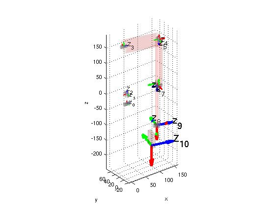
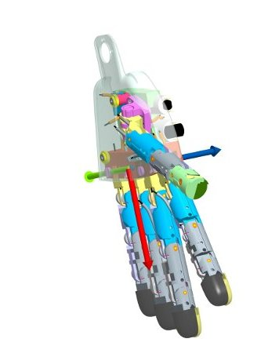

# **Cinemática directa del iCub - Brazos**

## Izquierdo
Aquí se describe cómo construir la matriz T_RoLa cuya definición es dada en [ICubForwardKinematics](./icub-forward-kinematics.md). La matriz es construida en dos pasos, es decir, T_RoLa = T_Ro0 * T_0n. La primera matriz T_Ro0 describe la roto-translación rígida desde el marco de referencia raíz hacia puntos en el marco de referencia 0 como se define según la [convención Denavit-Hartenberg](./assets/chap3-forward-kinematics.pdf). En este caso, T_Ro0 es solo una rotación rígida que alinea el eje z con la primera articulación de la cintura. La segunda matriz T_0n corresponde a la descripción de cinemática directa según la convención Denavit-Hartenberg, es decir, la roto-translación desde el marco de referencia 0 al marco de referencia n, siendo n el número de grados de libertad. La cinemática directa en este caso incluye la cintura y la cinemática del brazo izquierdo.

La matriz T_0n es la composición de n matrices como se define por la convención DH: `T_0n = T_01 T_12 ... T_(n-1)n`.
Aquí está el [código matlab](./assets/ICubFwdKinNew.zip) actualizado para calcular la cinemática directa con la notación Denavit Hartenberg.

La referencia de la mano está localizada en la palma como se muestra en la figura CAD. El eje '''x''' se muestra en color '''rojo'''. El eje '''y''' se muestra en color '''verde'''. El eje '''z''' se muestra en color '''azul'''.

|   |   |
|---|---|
| | |

Aquí se muestra la matriz T_Ro0:

|     |     |     |     |
|-----|-----|-----|-----|
| 0   | -1  | 0   | 0   |
| 0   | 0   | -1  | 0   |
| 1   | 0   | 0   | 0   |
| 0   | 0   | 0   | 1   |

Aquí se muestra la tabla de los valores de los parámetros DH para el **left arm v1**.

| Link i / H – D | Ai (mm) | d\_i (mm) | alpha\_i (rad) | theta\_i (deg)        |
|----------------|---------|-----------|----------------|-----------------------|
| i = 0          | 32      | 0         | pi/2           | -22 -&gt; 84          |
| i = 1          | 0       | -5.5      | pi/2           | -90 + (-39 -&gt; 39)  |
| i = 2          | 23.3647 | -143.3    | -pi/2          | 105 + (-59 -&gt; 59)  |
| i = 3          | 0       | 107.74    | -pi/2          | 90 + (5 -&gt; -95)    |
| i = 4          | 0       | 0         | pi/2           | -90 + (0 -&gt; 160.8) |
| i = 5          | 15      | 152.28    | -pi/2          | 75 + (-37 -&gt; 100)  |
| i = 6          | -15     | 0         | pi/2           | 5.5 -&gt; 106         |
| i = 7          | 0       | 137.3     | pi/2           | -90 + (-50 -&gt; 50)  |
| i = 8          | 0       | 0         | pi/2           | 90 + (10 -&gt; -65)   |
| i = 9          | 62.5    | -16       | 0              | (-25 -&gt; 25)        |

Aquí se muestra la tabla de los valores de los parámetros DH para el **left arm v1.7**.

| Link i / H – D | Ai (mm) | d\_i (mm)                                     | alpha\_i (rad) | theta\_i (deg)        |
|----------------|---------|-----------------------------------------------|----------------|-----------------------|
| i = 0          | 32      | 0                                             | pi/2           | -22 -&gt; 84          |
| i = 1          | 0       | -5.5                                          | pi/2           | -90 + (-39 -&gt; 39)  |
| i = 2          | 23.3647 | -143.3                                        | -pi/2          | 105 + (-59 -&gt; 59)  |
| i = 3          | 0       | 107.74                                        | -pi/2          | 90 + (5 -&gt; -95)    |
| i = 4          | 0       | 0                                             | pi/2           | -90 + (0 -&gt; 160.8) |
| i = 5          | 15      | 152.28                                        | -pi/2          | 75 + (-37 -&gt; 100)  |
| i = 6          | -15     | 0                                             | pi/2           | 5.5 -&gt; 106         |
| i = 7          | 0       | 141.3 | pi/2           | -90 + (-50 -&gt; 50)  |
| i = 8          | 0       | 0                                             | pi/2           | 90 + (10 -&gt; -65)   |
| i = 9          | 62.5    | -16                                           | 0              | (-25 -&gt; 25)        |

Aquí se muestra la tabla de los valores de los parámetros DH para el **left arm v2**.

| Link i / H – D | Ai (mm) | d\_i (mm)                                      | alpha\_i (rad) | theta\_i (deg)        |
|----------------|---------|------------------------------------------------|----------------|-----------------------|
| i = 0          | 32      | 0                                              | pi/2           | -22 -&gt; 84          |
| i = 1          | 0       | -5.5                                           | pi/2           | -90 + (-39 -&gt; 39)  |
| i = 2          | 23.3647 | -143.3                                         | -pi/2          | 105 + (-59 -&gt; 59)  |
| i = 3          | 0       | 107.74                                         | -pi/2          | 90 + (5 -&gt; -95)    |
| i = 4          | 0       | 0                                              | pi/2           | -90 + (0 -&gt; 160.8) |
| i = 5          | 15      | 152.28                                         | -pi/2          | 75 + (-37 -&gt; 100)  |
| i = 6          | -15     | 0                                              | pi/2           | 5.5 -&gt; 106         |
| i = 7          | 0       | 141.3  | pi/2           | -90 + (-50 -&gt; 50)  |
| i = 8          | 0       | 0                                              | pi/2           | 90 + (10 -&gt; -65)   |
| i = 9          | 62.5    | -25.98 | 0              | (-25 -&gt; 25)        |

## Derecho
Aquí se describe cómo construir la matriz T_RoRa cuya definición es dada en ICubForwardKinematics](./icub-forward-kinematics.md). La matriz es construida en dos pasos, es decir, T_RoRa = T_Ro0 * T_0n. La primera matriz T_Ro0 describe la roto-translación rígida desde el marco de referencia raíz hacia puntos en el marco de referencia 0 como se define según la [convención Denavit-Hartenberg](./assets/chap3-forward-kinematics.pdf). En este caso, T_Ro0 es solo una rotación rígida que alinea el eje z con la primera articulación de la cintura. La segunda matriz T_0n corresponde a la descripción de cinemática directa según la convención Denavit-Hartenberg, es decir, la roto-translación desde el marco de referencia 0 al marco de referencia n, siendo n el número de grados de libertad. La cinemática directa en este caso incluye la cintura y la cinemática del brazo derecho.

La matriz T_0n es la composición de n matrices como se define por la convención DH: `T_0n = T_01 T_12 ... T_(n-1)n`. 
Aquí está el [código matlab](./assets/ICubFwdKinNew.zip) actualizado para calcular la cinemática directa con la notación Denavit Hartenberg.

La referencia de la mano está localizada en la palma como se muestra en la figura CAD. El eje '''x''' se muestra en color '''rojo'''. El eje '''y''' se muestra en color '''verde'''. El eje '''z''' se muestra en color '''azul'''.

|   |   |
|---|---|
| | |

Here is the matrix T\_Ro0:

|     |     |     |     |
|-----|-----|-----|-----|
| 0   | -1  | 0   | 0   |
| 0   | 0   | -1  | 0   |
| 1   | 0   | 0   | 0   |
| 0   | 0   | 0   | 1   |

Aquí se muestra la tabla de los valores de los parámetros DH para el **right arm v1**.

| Link i / H – D | Ai (mm)  | d\_i (mm) | alpha\_i (rad) | theta\_i (deg)         |
|----------------|----------|-----------|----------------|------------------------|
| i = 0          | 32       | 0         | pi/2           | -22 -&gt; 84           |
| i = 1          | 0        | -5.5      | pi/2           | -90 + (-39 -&gt; 39)   |
| i = 2          | -23.3647 | -143.3    | pi/2           | -105 + (-59 -&gt; 59)  |
| i = 3          | 0        | -107.74   | pi/2           | -90 + (5 -&gt; -95)    |
| i = 4          | 0        | 0         | -pi/2          | -90 +(0 -&gt; 160.8)   |
| i = 5          | -15.0    | -152.28   | -pi/2          | -105 + (-37 -&gt; 100) |
| i = 6          | 15.0     | 0         | pi/2           | 5.5 -&gt; 106          |
| i = 7          | 0        | -137.3    | pi/2           | -90 + (-50 -&gt; 50)   |
| i = 8          | 0        | 0         | pi/2           | 90 + (10 -&gt; -65)    |
| i = 9          | 62.5     | 16        | 0              | (-25 -&gt; 25) + 180   |

Aquí se muestra la tabla de los valores de los parámetros DH para el **right arm v1.7**.

| Link i / H – D | Ai (mm)  | d\_i (mm)                                      | alpha\_i (rad) | theta\_i (deg)         |
|----------------|----------|------------------------------------------------|----------------|------------------------|
| i = 0          | 32       | 0                                              | pi/2           | -22 -&gt; 84           |
| i = 1          | 0        | -5.5                                           | pi/2           | -90 + (-39 -&gt; 39)   |
| i = 2          | -23.3647 | -143.3                                         | pi/2           | -105 + (-59 -&gt; 59)  |
| i = 3          | 0        | -107.74                                        | pi/2           | -90 + (5 -&gt; -95)    |
| i = 4          | 0        | 0                                              | -pi/2          | -90 +(0 -&gt; 160.8)   |
| i = 5          | -15.0    | -152.28                                        | -pi/2          | -105 + (-37 -&gt; 100) |
| i = 6          | 15.0     | 0                                              | pi/2           | 5.5 -&gt; 106          |
| i = 7          | 0        | -141.3 | pi/2           | -90 + (-50 -&gt; 50)   |
| i = 8          | 0        | 0                                              | pi/2           | 90 + (10 -&gt; -65)    |
| i = 9          | 62.5     | 16                                             | 0              | (-25 -&gt; 25) + 180   |

Aquí se muestra la tabla de los valores de los parámetros DH para el **right arm v2**.

| Link i / H – D | Ai (mm)  | d\_i (mm)                                      | alpha\_i (rad) | theta\_i (deg)         |
|----------------|----------|------------------------------------------------|----------------|------------------------|
| i = 0          | 32       | 0                                              | pi/2           | -22 -&gt; 84           |
| i = 1          | 0        | -5.5                                           | pi/2           | -90 + (-39 -&gt; 39)   |
| i = 2          | -23.3647 | -143.3                                         | pi/2           | -105 + (-59 -&gt; 59)  |
| i = 3          | 0        | -107.74                                        | pi/2           | -90 + (5 -&gt; -95)    |
| i = 4          | 0        | 0                                              | -pi/2          | -90 +(0 -&gt; 160.8)   |
| i = 5          | -15.0    | -152.28                                        | -pi/2          | -105 + (-37 -&gt; 100) |
| i = 6          | 15.0     | 0                                              | pi/2           | 5.5 -&gt; 106          |
| i = 7          | 0        | -141.3 | pi/2           | -90 + (-50 -&gt; 50)   |
| i = 8          | 0        | 0                                              | pi/2           | 90 + (10 -&gt; -65)    |
| i = 9          | 62.5     | 25.98  | 0              | (-25 -&gt; 25) + 180   |
