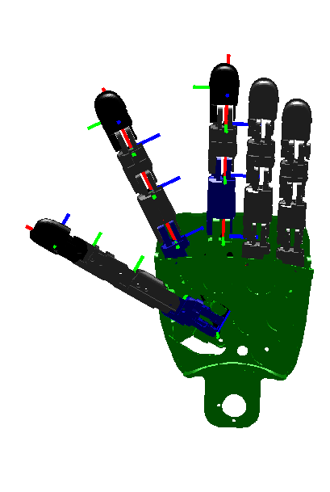

# **Cinemática directa del iCub - Dedos**

## Izquierdo
Esta página provee la cinemática directa de los dedos pulgar, índice y medio de la mano izquierda. Se describe la construcción de las matrices de todos los dedos (T_RoLt (pulgar), T_RoLi (índice) y T_RoLm (medio)). Cada matriz se construye en dos pasos, es decir, T_RoLfin = T_Ro0fin * T_0nfin (donde fin es t para el pulgar, i para el índice y m para el medio). La primera matriz T_Ro0 describe la roto-translación rígida desde el marco de referencia del efector final (descrita en [ICubFowardKinematics](icub-forward-kinematics-arms.md#izquierdo)) hasta los puntos en el marco de referencia 0 como se define en la [convención Denavit-Hartenberg](./assets/chap3-forward-kinematics.pdf). La segunda matriz T_0n corresponde a la descripción Denavit-Hartenberg de la cinemática directa, es decir, la roto-translación desde el marco de referencia 0 hasta el marco de referencia n, siendo n el número de grados de libertadad.

La matriz T_0n es la composición de n matrices como se define en la convención DH: `T_0n = T_01 T_12 ... T_(n-1)n`.

Los marcos se orientan como se muestra en la Figura. El eje '''x''' en color '''rojo'''. El eje '''y''' en color '''verde'''. El eje '''z''' en color azul.

### **Pulgar**

Aquí se muestra la matriz T\_Ro0t para el **thumb version a** (los largos se miden en mm):

|           |           |          |            |
|-----------|-----------|----------|------------|
| 0.121132  | 0.043736  | 0.991672 | -25.391770 |
| -0.958978 | 0.263104  | 0.105535 | -11.783901 |
| 0.256297  | -0.963776 | 0.073812 | 1.7018     |
| 0         | 0         | 0        | 1          |

Aquí se muestra la matriz T\_Ro0t para el **thumb version b** (los largos se miden en mm):

|           |           |          |            |
|-----------|-----------|----------|------------|
| 0.478469  | 0.063689  | 0.875792 | -24.029759 |
| -0.878095 | 0.039246  | 0.476873 | -11.93433  |
| 0.004     | -0.997198 | 0.074703 | 1.68926    |
| 0         | 0         | 0        | 1          |

Aquí se muestra la tabla de los parámetros DH para **thumb** (pulgar).

| Link i / H – D | Ai (mm) | di (mm) | alpha i (rad) | theta\_i (deg) |
|----------------|---------|---------|---------------|----------------|
| i = 0          | 0       | 0       | pi/2          | 10 -&gt; 90    |
| i = 1          | 21.0    | -5.6    | 0             | 0 (dummy link) |
| i = 2          | 26.0    | 0       | 0             | 0 -&gt; 90     |
| i = 3          | 22.0    | 0       | 0             | 0 -&gt; 90     |
| i = 4          | 16.8    | 0       | -pi/2         | 0 -&gt; 90     |

### **ÍNDICE**

Aquí se muestra la matriz  T\_Ro0i para el **index** (los largos se miden en mm):

|           |          |           |            |
|-----------|----------|-----------|------------|
| 0.898138  | 0.439714 | 0.0       | 2.45549    |
| -0.43804  | 0.89472  | -0.087156 | -25.320433 |
| -0.038324 | 0.078278 | 0.996195  | 10.973325  |
| 0         | 0        | 0         | 1          |

Aquí se muestra la tabla de los parámetros DH para **index** (índice).

| Link i / H – D | Ai (mm) | di (mm) | alpha i (rad) | theta\_i (deg) |
|----------------|---------|---------|---------------|----------------|
| i = 0          | 14.8    | 0       | -pi/2         | 0 -&gt; 20     |
| i = 1          | 25.9    | 0       | 0             | 0 -&gt; 90     |
| i = 2          | 22.0    | 0       | 0             | 0 -&gt; 90     |
| i = 3          | 16.8    | 0       | -pi/2         | 0 -&gt; 90     |

### **MEDIO**

Aquí se muestra la matriz T\_Ro0m para el **middle** (los largos se miden en mm):

|     |      |     |          |
|-----|------|-----|----------|
| 1.0 | 0.0  | 0.0 | 17.8     |
| 0.0 | 0.0  | 1.0 | -8.30233 |
| 0.0 | -1.0 | 0.0 | 11.8     |
| 0   | 0    | 0   | 1        |

Aquí se muestra la tabla de los parámetros DH para **middle** (medio).

| Link i / H – D | Ai (mm) | di (mm) | alpha i (rad) | theta\_i (deg) |
|----------------|---------|---------|---------------|----------------|
| i = 0          | 28.5    | 0       | 0             | 0 -&gt; 90     |
| i = 1          | 24.0    | 0       | 0             | 0 -&gt; 90     |
| i = 2          | 16.8    | 0       | -pi/2         | 0 -&gt; 90     |

## Derecho
Esta página provee la cinemática directa de los dedos pulgar, índice y medio de la mano derecha. Se describe la construcción de las matrices de todos los dedos (T_RoRt (pulgar), T_RoRi (índice) y T_RoRm (medio)). Cada matriz se construye en dos pasos, es decir, T_RoRfin = T_Ro0fin * T_0nfin (donde fin es t para el pulgar, i para el índice y m para el medio). La primera matriz T_Ro0 describe la roto-translación rígida desde el marco de referencia del efector final (descrita en [ICubFowardKinematics](icub-forward-kinematics-arms.md#derecho)) hasta los puntos en el marco de referencia 0 como se define en la [convención Denavit-Hartenberg](./assets/chap3-forward-kinematics.pdf). La segunda matriz T_0n corresponde a la descripción Denavit-Hartenberg de la cinemática directa, es decir, la roto-translación desde el marco de referencia 0 hasta el marco de referencia n, siendo n el número de grados de libertadad.

La matriz T_0n es la composición de n matrices como se define en la convención DH: `T_0n = T_01 T_12 ... T_(n-1)n`.

Los marcos se orientan como se muestra en la Figura. El eje '''x''' en color '''rojo'''. El eje '''y''' en color '''verde'''. El eje '''z''' en color azul.

### **PULGAR**

Aquí se muestra la matriz T\_Ro0t para el **thumb version a** (los largos se miden en mm):

|           |          |           |            |
|-----------|----------|-----------|------------|
| 0.121132  | 0.043736 | -0.991672 | -25.391770 |
| -0.958978 | 0.263104 | -0.105535 | -11.783901 |
| 0.256297  | 0.963776 | 0.073812  | -1.7018    |
| 0         | 0        | 0         | 1          |

Aquí se muestra la matriz T\_Ro0t para el **thumb version b** (los largos se miden en mm):

|           |          |           |            |
|-----------|----------|-----------|------------|
| 0.478469  | 0.063689 | -0.875792 | -24.029759 |
| -0.878095 | 0.039246 | -0.476873 | -11.93433  |
| 0.004     | 0.997198 | 0.074703  | -1.68926   |
| 0         | 0        | 0         | 1          |

Aquí se muestra la tabla de los parámetros DH para **thumb** (pulgar).

| Link i / H – D | Ai (mm) | di (mm) | alpha i (rad) | theta\_i (deg) |
|----------------|---------|---------|---------------|----------------|
| i = 0          | 0       | 0       | -pi/2         | 10 -&gt; 90    |
| i = 1          | 21.0    | 5.6     | 0             | 0 (dummy link) |
| i = 2          | 26.0    | 0       | 0             | 0 -&gt; 90     |
| i = 3          | 22.0    | 0       | 0             | 0 -&gt; 90     |
| i = 4          | 16.8    | 0       | -pi/2         | 0 -&gt; 90     |

### **ÍNDICE**

Aquí se muestra la matriz  T\_Ro0i para el **index** (los largos se miden en mm):

|          |           |          |            |
|----------|-----------|----------|------------|
| 0.898138 | 0.439714  | 0.0      | 2.45549    |
| -0.43804 | 0.89472   | 0.087156 | -25.320433 |
| 0.038324 | -0.078278 | 0.996195 | -10.973325 |
| 0        | 0         | 0        | 1          |

Aquí se muestra la tabla de los parámetros DH para **index** (índice).

| Link i / H – D | Ai (mm) | di (mm) | alpha i (rad) | theta\_i (deg) |
|----------------|---------|---------|---------------|----------------|
| i = 0          | 14.8    | 0       | pi/2          | 0 -&gt; 20     |
| i = 1          | 25.9    | 0       | 0             | 0 -&gt; 90     |
| i = 2          | 22.0    | 0       | 0             | 0 -&gt; 90     |
| i = 3          | 16.8    | 0       | -pi/2         | 0 -&gt; 90     |

### **MEDIO**

Aquí se muestra la matriz T\_Ro0m para el **middle** (los largos se miden en mm):

|     |     |      |          |
|-----|-----|------|----------|
| 1.0 | 0.0 | 0.0  | 17.8     |
| 0.0 | 0.0 | -1.0 | -8.30233 |
| 0.0 | 1.0 | 0.0  | -11.8    |
| 0   | 0   | 0    | 1        |

Aquí se muestra la tabla de los parámetros DH para **middle** (medio).

| Link i / H – D | Ai (mm) | di (mm) | alpha i (rad) | theta\_i (deg) |
|----------------|---------|---------|---------------|----------------|
| i = 0          | 28.5    | 0       | 0             | 0 -&gt; 90     |
| i = 1          | 24.0    | 0       | 0             | 0 -&gt; 90     |
| i = 2          | 16.8    | 0       | -pi/2         | 0 -&gt; 90     |
