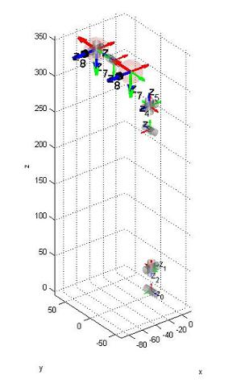
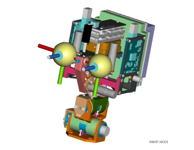

# Cinemática directa del iCub - Cabeza

## V1
Aquí se describe cómo construir las matrices $T_{RoLe}$ y $T_{RoRe}$ cuya definición es dada en  [ICubForwardKinematics](./icub-forward-kinematics.md). Las matrices se construyen en dos pasos, es decir, $T_{RoRe} = T_{Ro0} * T_{0n}$ y $T_{RoLe} = T_{Ro0} * T_{0n}'$. La primera matriz $T_{Ro0}$ describe la roto-translación rígida desde el marco de referencia raíz hacia puntos en el marco de referencia 0 como se define por la [convención Denavit-Hartenberg](./assets/chap3-forward-kinematics.pdf). En este caso, $T_{Ro0}$ es solo una rotación rígida que alinea el eje z con las primeras articulaciones de la cintura. Las matrices siguientes, $T_{0n}$ y $T_{0n}'$, corresponden a la descripción Denavit-Hartenberg de la cinemática directa de los ojos derecho e izquierdo, es decir, la roto-translación desde el marco de referencia 0 hasta el marco de referencia n, siendo n el número de grados de libertad. La cinemática directa $T_{0n}$ en este caso incluye la cintura y el ojo derecho.  La cinemática directa $T_{0n}'$ en este caso incluye la cintura y el ojo izquierdo.

Las matrices $T_{0n}$ y $T_{0n}'$ están compuestas de n matrices como se define en la convención DH: $T_0n = T_{01} T_{12} ... T_{(n-1)n}$ y $T_{0n}' = T_{01}' T_{12}' ... T_{(n-1)n}'$.
Aquí está el [código matlab](./assets/ICubFwdKinNew.zip) actualizado para calcular la cinemática directa utilizando la notación Denavit Hartenberg.

El marco de referencia de los ojos está localizado en la palma como se muestra en la figura CAD.
El eje <font color=#ff2e31>$X$</font> se muestra en rojo. El eje <font color=#2BE01B>$Y$</font> se muestra en color verde. El eje <font color=#0030f2>$Z$</font> se muestra en color azul.

|   |   |
|---|---|
| | |

Aquí está la matriz `T\_Ro0`:

|     |     |     |     |
|-----|-----|-----|-----|
| 0   | -1  | 0   | 0   |
| 0   | 0   | -1  | 0   |
| 1   | 0   | 0   | 0   |
| 0   | 0   | 0   | 1   |

Aquí se muestra la tabla de los parámetros DH que describen $T_{01}$, $T_{12}$, ... $T_{(n-1)n}$.

| Link i / H – D | Ai (mm) | d\_i (mm) | alpha\_i (rad) | theta\_i (deg)       |
|----------------|---------|-----------|----------------|----------------------|
| i = 0          | 32      | 0         | pi/2           | -22 -&gt; 84         |
| i = 1          | 0       | -5.5      | pi/2           | -90 + (-39 -&gt; 39) |
| i = 2          | 2.31    | -193.3    | -pi/2          | -90 + (-59 -&gt; 59) |
| i = 3          | 33      | 0         | pi/2           | 90 + (-40 -&gt; 30)  |
| i = 4          | 0       | 1         | -pi/2          | -90 + (-70 -&gt; 60) |
| i = 5          | -54     | 82.5      | -pi/2          | 90 + (-55 -&gt; 55)  |
| i = 6          | 0       | 34        | -pi/2          | -35 -&gt; 15         |
| i = 7          | 0       | 0         | pi/2           | -90 + (-50 -&gt; 50) |

Aquí se muestra la tabla de los parámetros DH que describen $T_{01}'$,
$T_{12}'$, ... $T_{(n-1)n}'$.

| Link i / H – D | Ai (mm) | d\_i (mm) | alpha\_i (rad) | theta\_i (deg)       |
|----------------|---------|-----------|----------------|----------------------|
| i = 0          | 32      | 0         | pi/2           | -22 -&gt; 84         |
| i = 1          | 0       | -5.5      | pi/2           | -90 + (-39 -&gt; 39) |
| i = 2          | 2.31    | -193.3    | -pi/2          | -90 + (-59 -&gt; 59) |
| i = 3          | 33      | 0         | pi/2           | 90 + (-40 -&gt; 30)  |
| i = 4          | 0       | 1         | -pi/2          | -90 + (-70 -&gt; 60) |
| i = 5          | -54     | 82.5      | -pi/2          | 90 + (-55 -&gt; 55)  |
| i = 6          | 0       | -34       | -pi/2          | -35 -&gt; 15         |
| i = 7          | 0       | 0         | pi/2           | -90 + (-50 -&gt; 50) |

```
Joint Poses (x y z, roll, pitch, yaw) w.r.t. root:
Eyes tilt (G\_sl6) = -62.81 0 340.8 1.57079 0 0
Right Eye (G\_sl7) = -62.81 34 340.8 -3.14159 0 0
Left Eye (Gp\_sl7) = -62.81 -34 340.8 -3.14159 0 0
Right Eye (G\_sl8) = -62.81 34 340.8 0 1.57079 0
Left Eye (Gp\_sl8) = -62.81 -34 340.8 0 1.57079 0
```

## V2
Aquí se describe cómo construir las matrices $T_{RoLe}$ y $T_{RoRe}$ cuya definición es dada en  [ICubForwardKinematics](./icub-forward-kinematics.md). Las matrices son construidas en tres pasos, es decir, $T_{RoRe} = T_{Ro0} * T_{0n} * T_{nE}$ and $T_{RoLe} = T_{Ro0} * T_{0n}' * T_{nE}$. La primera matriz $T_{Ro0}$ describe la roto-translación rígida desde el marco de referencia raíz hacia puntos en el marco de referencia 0 como se define por la [convención Denavit-Hartenberg](./assets/chap3-forward-kinematics.pdf). En este caso, $T_{Ro0}$ es solo una rotación rígida que alinea el eje z con las primeras articulaciones de la cintura. Las matrices siguientes, $T_{0n}$ y $T_{0n}'$, corresponden a la descripción Denavit-Hartenberg de la cinemática directa de los ojos derecho e izquierdo, es decir, la roto-translación desde el marco de referencia 0 hasta el marco de referencia n, siendo n el número de grados de libertad. La cinemática directa $T_{0n}$ en este caso incluye la cintura y el ojo derecho.  La cinemática directa $T_{0n}'$ en este caso incluye la cintura y el ojo izquierdo. La última matriz $T_{nE}$ representa la roto-translación desde el marco de referencia n hacia el marco ubicado en el sensor de la cámara.

Las matrices $T_{0n}$ y $T_{0n}'$ están compuestas de n matrices como se define en la convención DH: $T_{0n} = T_{01} T_{12} ... T_{(n-1)n}$  y  $ T_{0n}' = T_{01}' T_{12}' ... T_{(n-1)n}'$.
Aquí está el [código matlab](./assets/ICubFwdKinNewV2.zip) actualizado para calcular la cinemática directa utilizando la notación Denavit Hartenberg.

El marco de referencia de los ojos está localizado en la palma como se muestra en la figura CAD.
El eje <font color=#ff2e31>$X$</font> se muestra en rojo. El eje <font color=#2BE01B>$Y$</font> se muestra en color verde. El eje <font color=#0030f2>$Z$</font> se muestra en color azul.

|   |   |
|---|---|
| | |

Aquí está la matriz $T_{Ro0}$ :

$$
\begin{equation}
T_{Ro0} = 
\begin{bmatrix}
0 & -1 & 0 & 0 \\
0 & 0 & -1 & 0 \\
1 & 0 & 0 & 0 \\
0 & 0 & 0 & 1 \\
\end{bmatrix}
\end{equation}
$$

Aquí se muestra la tabla de los parámetros DH que describen $T_{01},T_{12}, \dots T_{(n-1)n}$ :

| Link i / H – D | Ai (mm) | d\_i (mm) | alpha\_i (rad) | theta\_i (deg)       |
|----------------|---------|-----------|----------------|----------------------|
| i = 0          | 32      | 0         | pi/2           | -22 -&gt; 84         |
| i = 1          | 0       | -5.5      | pi/2           | -90 + (-39 -&gt; 39) |
| i = 2          | 0       | -223.3    | -pi/2          | -90 + (-40 -&gt; 22) |
| i = 3          | 9.5     | 0         | pi/2           | 90 + (-20 -&gt; 20)  |
| i = 4          | 0       | 0         | -pi/2          | -90 + (-50 -&gt; 50) |
| i = 5          | -50.9   | 82.05     | -pi/2          | 90 + (-30 -&gt; 30)  |
| i = 6          | 0       | 34        | -pi/2          | -15 -&gt; 15         |
| i = 7          | 0       | 0         | pi/2           | -90 + (-30 -&gt; 30) |

Aquí se muestra la tabla de los parámetros DH que describen $T_{01}',T_{12}', \dots T_{(n-1)n}'$ :

| Link i / H – D | Ai (mm) | d\_i (mm) | alpha\_i (rad) | theta\_i (deg)       |
|----------------|---------|-----------|----------------|----------------------|
| i = 0          | 32      | 0         | pi/2           | -22 -&gt; 84         |
| i = 1          | 0       | -5.5      | pi/2           | -90 + (-39 -&gt; 39) |
| i = 2          | 0       | -223.3    | -pi/2          | -90 + (-40 -&gt; 22) |
| i = 3          | 9.5     | 0         | pi/2           | 90 + (-20 -&gt; 20)  |
| i = 4          | 0       | 0         | -pi/2          | -90 + (-50 -&gt; 50) |
| i = 5          | -50.9   | 82.05     | -pi/2          | 90 + (-30 -&gt; 30)  |
| i = 6          | 0       | -34       | -pi/2          | -15 -&gt; 15         |
| i = 7          | 0       | 0         | pi/2           | -90 + (-30 -&gt; 30) |

Para ambos ojos, la matriz end-effector $T_{nE}$ desde el último enlace hacia el sensor de la cámara es:

$$
\begin{equation}
T_{nE} = 
\begin{bmatrix}
1 & 0 & 0 & 0 \\
0 & 1 & 0 & 0 \\
0 & 0 & 1 & -2.15mm \\
0 & 0 & 0 & 1 \\
\end{bmatrix}
\end{equation}
$$
