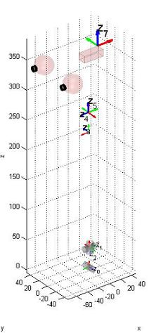

# Cinemática directa del iCub - Sensor inercial IMU

## V1
Aquí se describe cómo construir la matriz T_RoIs cuya definición se da en [ICubForwardKinematics](./icub-forward-kinematics.md). La matriz es construida en tres pasos, es decir, `T_RoIs = T_Ro0 * T_0n * T_nIs`. La primera matriz T_Ro0 describe la roto-translación rígida desde el marco de referencia raíz hasta puntos en el marco de referencia 0 como se define en la [convención Denavit-Hartenberg](./assets/chap3-forward-kinematics.pdf). En este caso, T_Ro0 es solo una rotación rígida que alinea el eje z con la primera articulación de la cintura. La segunda matriz T_0n corresponde a la descripción  Denavit-Hartenberg de la cinemática directa de cintura y cuello, es decir, la roto-translación desde el marco de referencia 0 hasta el marco de referencia n, siendo n el número de grados de libertad. La cinemática directa T_0n en este caso incluye la cintura y el cuello.

La matriz T_0n corresponde a la composición de n matrices como se define en la convención DH: `T_0n = T_01 T_12 ... T_(n-1)n`. 
Aquí está el [código matlab](./assets/ICubFwdKinNew.zip) actualizado para calcular la cinemática directa utilizando la notación Denavit Hartenberg.

El marco de referencia del sensor está localizado en la palma como se muestra en la figura CAD. 
El eje '''x''' está en '''rojo'''. El eje '''y''' está en '''verde'''. El eje '''z''' está en azul.

|   |   |
|---|---|
| | |

Aquí está la matriz `T\_Ro0`:

|     |     |     |     |
|-----|-----|-----|-----|
| 0   | -1  | 0   | 0   |
| 0   | 0   | -1  | 0   |
| 1   | 0   | 0   | 0   |
| 0   | 0   | 0   | 1   |

Aquí se muestra la tabla de los parámetros DH que describen `T\_01,T\_12, ... T\_(n-1)n`.

| Link i / H – D | Ai (mm) | d\_i (mm) | alpha\_i (rad) | theta\_i (deg)       |
|----------------|---------|-----------|----------------|----------------------|
| i = 0          | 32      | 0         | pi/2           | -22 -&gt; 84         |
| i = 1          | 0       | -5.5      | pi/2           | -90 + (-39 -&gt; 39) |
| i = 2          | 2.31    | -193.3    | -pi/2          | -90 + (-59 -&gt; 59) |
| i = 3          | 33      | 0         | pi/2           | 90 + (-40 -&gt; 30)  |
| i = 4          | 0       | 1         | -pi/2          | -90 + (-70 -&gt; 60) |
| i = 5          | 22.5    | 100.5     | -pi/2          | 90 + (-55 -&gt; 55)  |

Aquí está la matriz `T\_nIs`:

|     |     |     |     |
|-----|-----|-----|-----|
| 1   | 0   | 0   | 0   |
| 0   | 0   | -1  | 0   |
| 0   | 1   | 0   | 6.6 |
| 0   | 0   | 0   | 1   |

En algunas circunstancias, puede ser conveniente pensar en representar T\_nls como un enlace virtual localizado al final de la cadena y con sus articulaciones constantes en 0. Los parámetros DH de este enlace virtual son:

| Link i / H – D | Ai (mm) | d\_i (mm) | alpha\_i (rad) | theta\_i (deg) |
|----------------|---------|-----------|----------------|----------------|
| i = 6          | 0       | 6.6       | pi/2           | 0              |

# V2
Aquí se describe cómo construir la matriz T_RoIs cuya definición se da en [ICubForwardKinematics](./icub-forward-kinematics.md). La matriz se construye en tres pasos, es decir, `T_RoIs = T_Ro0 * T_0n * T_nIs`. La primera matriz T_Ro0 describe la roto-translación rígida desde el marco de referencia raíz hacia los puntos en el marco de referencia 0 como se define según la [convención Denavit-Hartenberg](./assets/chap3-forward-kinematics.pdf). En este caso, T_Ro0 es solo una rotación rígida que alinea el eje z con la primera articulación de la cintura. La segunda matriz T_0n corresponde a la descripción Denavit-Hartenberg de la cinemática directa de cintura y cuello, es decir, la roto-translación desde el marco de referencia 0 hasta el marco de referencia n, siendo n el número de grados de libertad. La cinemática directa T_0n en este caso incluye la cintura y el cuello.

La matriz T_0n es la composición de n matrices como se define según la convención DH: `T_0n = T_01 T_12 ... T_(n-1)n`. 
Aquí está el [código matlab](./assets/ICubFwdKinNewV2.zip) actualizado para calcular la cinemática directa con la notación Denavit Hartenberg.

Como se muestra en la figura CAD, el marco de referencia del sensor está localizado en la palma. 
El eje '''x''' está en '''rojo'''. El eje '''y''' está en '''verde'''. El eje '''z''' está en azul.

|   |   |
|---|---|
| | |

Aquí está la matriz `T\_Ro0`:

|     |     |     |     |
|-----|-----|-----|-----|
| 0   | -1  | 0   | 0   |
| 0   | 0   | -1  | 0   |
| 1   | 0   | 0   | 0   |
| 0   | 0   | 0   | 1   |

Aquí se muestra la tabla con los parámetros DH que describen `T\_01,T\_12, ... T\_(n-1)n`.

| Link i / H – D | Ai (mm) | d\_i (mm) | alpha\_i (rad) | theta\_i (deg)       |
|----------------|---------|-----------|----------------|----------------------|
| i = 0          | 32      | 0         | pi/2           | -22 -&gt; 84         |
| i = 1          | 0       | -5.5      | pi/2           | -90 + (-39 -&gt; 39) |
| i = 2          | 0       | -223.3    | -pi/2          | -90 + (-59 -&gt; 59) |
| i = 3          | 9.5     | 0         | pi/2           | 90 + (-40 -&gt; 30)  |
| i = 4          | 0       | 0         | -pi/2          | -90 + (-70 -&gt; 60) |
| i = 5          | 18.5    | 110.8     | -pi/2          | 90 + (-55 -&gt; 55)  |

Aquí está la matriz `T\_nIs`:

|     |     |     |     |
|-----|-----|-----|-----|
| 1   | 0   | 0   | 0   |
| 0   | 0   | -1  | 0   |
| 0   | 1   | 0   | 6.6 |
| 0   | 0   | 0   | 1   |

En algunas circunstancias, puede ser conveniente pensar en representar T\_nls como un enlace virtual localizado al final de la cadena y con sus articulaciones constantes en 0. Los parámetros DH de este enlace virtual son:

| Link i / H – D | Ai (mm) | d\_i (mm) | alpha\_i (rad) | theta\_i (deg) |
|----------------|---------|-----------|----------------|----------------|
| i = 6          | 0       | 6.6       | pi/2           | 0              |
