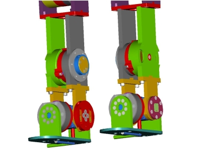

# **Cinemática directa del iCub - Piernas**

 
## Izquierda-V1
Aquí se describe cómo construir la matriz T_RoLf cuya definición está dada en [ICubForwardKinematics](./icub-forward-kinematics.md). La matriz se construye en dos pasos, es decir, T_RoLf = T_Ro0 * T_0n. La primera matriz T_Ro0 describe la roto-translación rígida desde el marco de referencia raíz hacia puntos en el marco de referencia 0 como se define según la [convención Denavit-Hartenberg](./assets/chap3-forward-kinematics.pdf). En este caso, T_Ro0 es solo una rotación rígida que alinea el eje z con la primera articulación de la cintura. La segunda matriz T_0n corresponde a la descripción de cinemática directa según la convención Denavit-Hartenberg, es decir, la roto-translación desde el marco de referencia 0 al marco de referencia n, siendo n el número de grados de libertad.

La matriz T_0n es la composición de n matrices como se define por la convención DH: `T_0n = T_01 T_12 ... T_(n-1)n`.
Aquí está el [código matlab](./assets/ICubFwdKinNew.zip) actualizado para calcular la cinemática directa con la notación Denavit Hartenberg.

La referencia del pie está localizada en la palma como se muestra en la figura CAD. El eje '''x''' se muestra en color '''rojo'''. El eje '''y''' se muestra en color '''verde'''. El eje '''z''' se muestra en color '''azul'''.

|   |   |
|---|---|
| | |

Aquí está la matriz T\_Ro0:

|     |     |     |        |
|-----|-----|-----|--------|
| 1   | 0   | 0   | 0      |
| 0   | 0   | 1   | -68.1  |
| 0   | -1  | 0   | -119.9 |
| 0   | 0   | 0   | 1      |

Aquí se muestra la tabla de los parámetros DH que describen T\_01,
T\_12, ... T\_(n-1)n.

| Link i / H – D | Ai (mm) | d\_i (mm) | alpha\_i (rad) | theta\_i (deg)         |
|----------------|---------|-----------|----------------|------------------------|
| i = 0          | 0       | 0         | -pi/2          | 90 + (-44 -&gt; +132)  |
| i = 1          | 0       | 0         | -pi/2          | 90 + (-119 - &gt; +17) |
| i = 2          | 0       | -223.6    | pi/2           | -90 + (-79 -&gt; +79)  |
| i = 3          | -213    | 0         | pi             | 90 + (-125 -&gt; +0)   |
| i = 4          | 0       | 0         | -pi/2          | -42 -&gt; +21          |
| i = 5          | -41     | 0         | 0              | -24 -&gt; +24          |

 
## Izquierda-V2_5
Aquí se describe cómo construir la matriz T_RoLf cuya definición está dada en [ICubForwardKinematics](./icub-forward-kinematics.md). La matriz se construye en dos pasos, es decir, T_RoLf = T_Ro0 * T_0n. La primera matriz T_Ro0 describe la roto-translación rígida desde el marco de referencia raíz hacia puntos en el marco de referencia 0 como se define según la [convención Denavit-Hartenberg](./assets/chap3-forward-kinematics.pdf). En este caso, T_Ro0 es solo una rotación rígida que alinea el eje z con la primera articulación de la cintura. La segunda matriz T_0n corresponde a la descripción de cinemática directa según la convención Denavit-Hartenberg, es decir, la roto-translación desde el marco de referencia 0 al marco de referencia n, siendo n el número de grados de libertad.

La matriz T_0n es la composición de n matrices como se define por la convención DH: `T_0n = T_01 T_12 ... T_(n-1)n`.
Aquí está el [código matlab](./assets/ICubFwdKinNew.zip) actualizado para calcular la cinemática directa con la notación Denavit Hartenberg.

La referencia del pie está localizada en la suela como se muestra en la figura CAD. El eje '''x''' se muestra en color '''rojo'''. El eje '''y''' se muestra en color '''verde'''. El eje '''z''' se muestra en color '''azul'''.

Aquí está la matriz T\_Ro0:

|     |     |     |        |
|-----|-----|-----|--------|
| 1   | 0   | 0   | 0      |
| 0   | 0   | 1   | -68.1  |
| 0   | -1  | 0   | -119.9 |
| 0   | 0   | 0   | 1      |

Aquí se muestra la tabla de los parámetros DH que describen T\_01,
T\_12, ... T\_(n-1)n.

| Link i / H – D | a\_i (mm) | d\_i (mm) | alpha\_i (rad) | theta\_{i} + (ang. range) (deg) |
|----------------|-----------|-----------|----------------|---------------------------------|
| i = 0          | 0         | 0         | -pi/2          | 90 + (-44 -&gt; +132)           |
| i = 1          | 0         | 0         | -pi/2          | 90 + (-119 - &gt; +17)          |
| i = 2          | -0.9175   | -234.545  | pi/2           | -90 + (-79 -&gt; +79)           |
| i = 3          | -200.5    | 0         | pi             | 90 + (-125 -&gt; +0)            |
| i = 4          | 0         | 0         | -pi/2          | 0 + (-42 -&gt; +21)             |
| i = 5          | -68.05    | -3.5      | 0              | 0 + (-24 -&gt; +24)             |

  [ICubForwardKinematics]: ICubForwardKinematics "wikilink"
  [Denavit-Hartenberg convention]: http://www.cs.duke.edu/brd/Teaching/Bio/asmb/current/Papers/chap3-forward-kinematics.pdf
  [Media: ICubFwdKinNew.zip]: Media:_ICubFwdKinNew.zip "wikilink"
  [1]: DHLeftLegV2_5.png "DHLeftLegV2_5.png"

# CinemáticaICubCinturaPiernaDerecha

 
## Derecha-V1
Aquí se describe cómo construir la matriz T_RoRf cuya definición está dada en [ICubForwardKinematics](./icub-forward-kinematics.md). La matriz se construye en dos pasos, es decir, T_RoRf = T_Ro0 * T_0n. La primera matriz T_Ro0 describe la roto-translación rígida desde el marco de referencia raíz hacia puntos en el marco de referencia 0 como se define según la [convención Denavit-Hartenberg](./assets/chap3-forward-kinematics.pdf). En este caso, T_Ro0 es solo una rotación rígida que alinea el eje z con la primera articulación de la cintura. La segunda matriz T_0n corresponde a la descripción de cinemática directa según la convención Denavit-Hartenberg, es decir, la roto-translación desde el marco de referencia 0 al marco de referencia n, siendo n el número de grados de libertad.

La matriz T_0n es la composición de n matrices como se define por la convención DH: `T_0n = T_01 T_12 ... T_(n-1)n`.
Aquí está el [código matlab](./assets/ICubFwdKinNew.zip) actualizado para calcular la cinemática directa con la notación Denavit Hartenberg.

La referencia del pie está localizada en la palma como se muestra en la figura CAD. El eje '''x''' se muestra en color '''rojo'''. El eje '''y''' se muestra en color '''verde'''. El eje '''z''' se muestra en color '''azul'''.

|   |   |
|---|---|
| | |

Aquí está la matriz T\_Ro0:
|     |     |     |        |
|-----|-----|-----|--------|
| 1   | 0   | 0   | 0      |
| 0   | 0   | 1   | 68.1   |
| 0   | -1  | 0   | -119.9 |
| 0   | 0   | 0   | 1      |

Aquí se muestra la tabla de los parámetros DH que describen T\_01,
T\_12, ... T\_(n-1)n.

| Link i / H – D | Ai (mm) | d\_i (mm) | alpha\_i (rad) | theta\_i (deg)         |
|----------------|---------|-----------|----------------|------------------------|
| i = 0          | 0       | 0         | pi/2           | 90 + (-44 -&gt; +132)  |
| i = 1          | 0       | 0         | pi/2           | 90 + (-119 - &gt; +17) |
| i = 2          | 0       | 223.6     | -pi/2          | -90 + (-79 -&gt; +79)  |
| i = 3          | -213    | 0         | pi             | 90 + (-125 -&gt; +0)   |
| i = 4          | 0       | 0         | pi/2           | -42 -&gt; +21          |
| i = 5          | -41     | 0         | pi             | (-24 -&gt; +24)        |

 
## Derecha-V2_5
Aquí se describe cómo construir la matriz T_RoLf cuya definición está dada en [ICubForwardKinematics](./icub-forward-kinematics.md). La matriz se construye en dos pasos, es decir, T_RoLf = T_Ro0 * T_0n. La primera matriz T_Ro0 describe la roto-translación rígida desde el marco de referencia raíz hacia puntos en el marco de referencia 0 como se define según la [convención Denavit-Hartenberg](./assets/chap3-forward-kinematics.pdf). En este caso, T_Ro0 es solo una rotación rígida que alinea el eje z con la primera articulación de la cintura. La segunda matriz T_0n corresponde a la descripción de cinemática directa según la convención Denavit-Hartenberg, es decir, la roto-translación desde el marco de referencia 0 al marco de referencia n, siendo n el número de grados de libertad.

La matriz T_0n es la composición de n matrices como se define por la convención DH: `T_0n = T_01 T_12 ... T_(n-1)n`.
Aquí está el [código matlab](./assets/ICubFwdKinNew.zip) actualizado para calcular la cinemática directa con la notación Denavit Hartenberg.

La referencia del pie está localizada en la suela como se muestra en la figura CAD. El eje '''x''' se muestra en color '''rojo'''. El eje '''y''' se muestra en color '''verde'''. El eje '''z''' se muestra en color '''azul'''.

Aquí está la matriz T\_Ro0:

|     |     |     |        |
|-----|-----|-----|--------|
| 1   | 0   | 0   | 0      |
| 0   | 0   | 1   | 68.1   |
| 0   | -1  | 0   | -119.9 |
| 0   | 0   | 0   | 1      |

Aquí se muestra la tabla de los parámetros DH que describen T\_01,
T\_12, ... T\_(n-1)n.

| Link i / H – D | Ai (mm) | d\_i (mm) | alpha\_i (rad) | theta\_i + (ang. range) (deg) |
|----------------|---------|-----------|----------------|-------------------------------|
| i = 0          | 0       | 0         | pi/2           | 90 + (-44 -&gt; +132)         |
| i = 1          | 0       | 0         | pi/2           | 90 + (-119 -&gt; +17)         |
| i = 2          | -0.9175 | 234.545   | -pi/2          | -90 + (-79 -&gt; +79)         |
| i = 3          | -200.5  | 0         | pi             | 90 + (-125 -&gt; +0)          |
| i = 4          | 0       | 0         | pi/2           | 0 + (-42 -&gt; +21)           |
| i = 5          | -68.05  | 3.5       | pi             | 0 + (-24 -&gt; +24)           |
