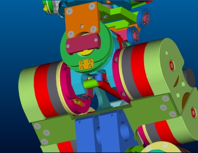
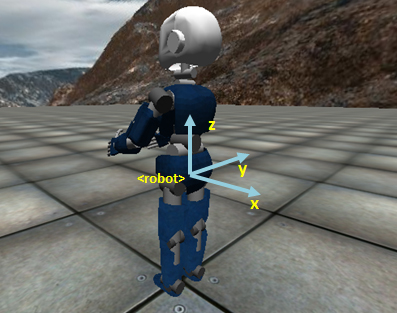
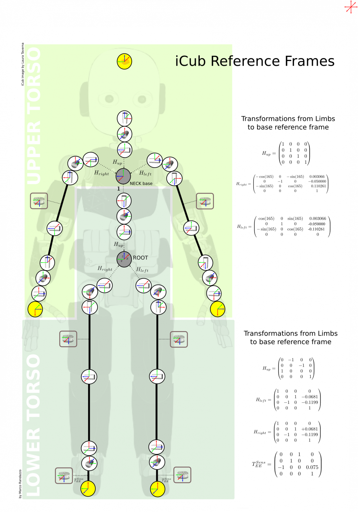

# **Cinemática directa del iCub**
La cinemática directa del iCub está descrita con respecto a un (root) marco de referencia que es posicionado al nivel de la cintura en el centro del robot como se representa en la siguiente figura (cilindros coloreados: el eje x está en rojo, el eje y en verde y el eje z en azul).

|   |   |
|---|---|
| | |

El origen del marco de referencia raíz es un punto en el eje de rotación del torso pitch. Entre todos los puntos en este eje, el origen se localiza en el medio del robot entremedio de las dos piernas.

1. El eje z del marco de referencia raíz es paralelo a la gravedad pero apuntando hacia arriba.
2. El eje x del marco de referencia raíz apunta detrás del robot.
3. El eje y del marco de referencia raíz apunta lateralmente y se escoge de acuerdo a la regla de la mano derecha.

Para visualizarlo de manera más simple, el marco de referencia raíz de la cinemática directa está representado en la figura de abajo (en celeste) (para posición exacta referirse a las figuras CAD de abajo):

Seven additional reference frames are defined with respect to this common root reference frame. The reference frames are located as shown in the CAD figure. The x axis is in red. The y axis is in green. The z axis is in blue.

- Marco de referencia mano izquierda ([ver imagen CAD](./assets/LeftHandCADRefFrame.jpg))
- Marco de referencia mano derecha ([ver imagen CAD](./assets/RightHandCADRefFrame.jpg))
- Marco de referencia dedos izquierdos ([ver imagen CAD](./assets/LeftHand.png))
- Marco de referencia dedos derechs ([ver imagen CAD](./assets/RightHand.png))
- Marco de referencia pie izquierdo ([ver imagen CAD](./assets/LegsCADRefFrame.jpg))
- Marco de referencia pie derecho ([ver imagen CAD](./assets/LegsCADRefFrame.jpg))
- Marco de referencia dedo izquierdo ([ver imagen CAD](./assets/HeadCADRefFrame.jpg))
- Marco de referencia dedo derecho ([ver imagen CAD](./assets/HeadCADRefFrame.jpg))
- Marco de referencia sensor de inercia ([ver imagen CAD](./assets/InertiaCADRefFrame.jpg))

La roto-translación que converte un punto en uno de esos marcos de referencia a la raíz de marco de referencia son dados por las siguientes matrices SE(3):

| End effector      |       | Marco de referencia | SE(3) Matriz                  | Descripción                                                                                | archivos Matlab                    |
|-------------------|-------|-----------------|-------------------------------|--------------------------------------------------------------------------------------------|---------------------------------|
|                   |       |                 |                               |                                                                                            |                                 |
| Todo               | -&gt; | Raíz            | **-**                         | Cuerpo completo (todos los marcos de referencia)                                                          | [ICubFwdKinNew.zip](./assets/ICubFwdKinNew.zip)     |
|                   |       |                 |                               |                                                                                            |                                 |
| Brazo izquierdo          | -&gt; | Raíz            | **T\_RoLa**                   | [Cinemática Directa brazo Izquierdo](./icub-forward-kinematics-arms.md#izquierdo)                                                      | [ICubFwdKinNew.zip](./assets/ICubFwdKinNew.zip)      |
| Brazo derecho         | -&gt; | Raíz            | **T\_RoRa**                   | [Cinemática Directa brazo Derecho](./icub-forward-kinematics-arms.md#derecho)                                                     | [ICubFwdKinNew.zip](./assets/ICubFwdKinNew.zip)      |
| Mano izquierda         | -&gt; | Raíz           | **T\_RoLt, T\_RoLi, T\_RoLm** | [Cinemática Directa dedos Izquierdos](./icub-forward-kinematics-fingers.md#izquierdo)                                                  | -                            |
| Mano izquierda       | -&gt; | Raíz            | **T\_RoRt, T\_RoRi, T\_RoRm** | [Cinemática Directa dedos Derechos](./icub-forward-kinematics-fingers.md#derecho)                                             | -                            |
| Pie izquierdo V1      | -&gt; | Raíz            | **T\_RoLf**                   | [Cinemática Directa pierna Izquierda V1](./icub-forward-kinematics-legs.md#izquierda-v1)                                                  | [ICubFwdKinNew.zip](./assets/ICubFwdKinNew.zip)      |
| Pie izquierdo V2.5    | -&gt; | Raíz            | **T\_RoLf**                   | [Cinemática Directa pierna Izquierda V2.5](./icub-forward-kinematics-legs.md#izquierda-v2_5)                                                 | [ICubFwdKinNewV2.5.zip](./assets/ICubFwdKinNewV2.5.zip)  |
| Pie derecho V1     | -&gt; | Raíz            | **T\_RoRf**                   | [Cinemática Directa pierna Derecha V1](./icub-forward-kinematics-legs.md#derecha-v1)                                                   | [ICubFwdKinNew.zip](./assets/ICubFwdKinNew.zip)      |
| Pie derecho V2.5   | -&gt; | Raíz            | **T\_RoRf**                   | [Cinemática Directa pierna Derecha V2.5](./icub-forward-kinematics-legs.md#derecha-v2_5)                                           | [ICubFwdKinNewV2.5.zip](./assets/ICubFwdKinNewV2.5.zip) |
| Ojo izquierdo V1       | -&gt; | Raíz            | **T\_RoLe**                   | [ iCub Head Forward Kinematics (left eye) V1](./icub-forward-kinematics-head.md#v1)                                            | [ICubFwdKinNew.zip](./assets/ICubFwdKinNew.zip)      |
| Ojo izquierdo V2       | -&gt; | Raíz            | **T\_RoLe**                   | [ iCub Head Forward Kinematics (left eye) V2](./icub-forward-kinematics-head.md#v2)                                            | [ICubFwdKinNewV2.zip](./assets/ICubFwdKinNewV2.zip)   |
| Ojo derecho V1      | -&gt; | Raíz            | **T\_RoRe**                   | [ iCub Head Forward Kinematics (right eye) V1](./icub-forward-kinematics-head.md#v1) | [ICubFwdKinNew.zip](./assets/ICubFwdKinNew.zip)      |
| Ojo derecho V2      | -&gt; | Raíz            | **T\_RoRe**                   | [ iCub Head Forward Kinematics (right eye) V2](./icub-forward-kinematics-head.md#v2) | [ICubFwdKinNewV2.zip](./assets/ICubFwdKinNewV2.zip)   |
| Sensor de inercia V1 | -&gt; | Raíz            | **T\_RoIs**                   | [ iCub Inertial Sensor Forward Kinematics V1](./icub-forward-kinematics-imu.md#v1)                                            | [ICubFwdKinNew.zip](./assets/ICubFwdKinNew.zip)      |
| Sensor de inercia V2 | -&gt; | Raíz            | **T\_RoIs**                   | [ iCub Inertial Sensor Forward Kinematics V2](./icub-forward-kinematics-imu.md#v2)                                            | [ICubFwdKinNewV2.zip](./assets/ICubFwdKinNewV2.zip)   |

Cada una de estas matrices es construida en dos pasos. El primero consiste en una roto-translación rígida desde los puntos en el marco de referencia raíz hacia los puntos en el marco de referencia 0 como se define en la convención Denavit-Hartenberg. El segundo paso corresponde a la descripción de la cinemática directa, es decir, la roto-translación del marco de referencia 0 al marco de referencia **n**, siendo n el número de grados de libertad.

Finalmente, la siguiente imagen muestra el marco de referencia raíz y todos los otros sistemas coordenados de cada articulación del robot (sin incluir las manos), junto con la transformación de matrices desde miembros hacia marcos de referencia base. La división superior/inferior de Torso se ha hecho de acuerdo a la convención de la librería iDyn (que es distinta a la encontrada en la librería iKin).

