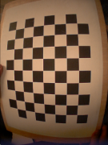

# Calibración estéreo
En este tutorial se explica cómo correr el procedimiento de calibración estéreo con el módulo `stereoCalib`. Antes de empezar el procedimiento, imprimir un tablero con patrón de calibración. Por conveniencia, se puede encontrar en `$ICUB_ROOT/app/cameraCalibration/data`.

Asegurarse de tener un archivo de configuración, por ejemplo, cameraCalib.ini, con la siguiente información:

```xml
[STEREO_CALIBRATION_CONFIGURATION]
boardWidth W
boardHeight H
boardSize S
numberOfImages N
MonoCalib value
```

El boardWidth W es el número de esquinas a lo largo del ancho del tablero (Por ejemplo, 8 para el patrón dado).

El boardHeight H es el número de esquinas a lo largo de la altura del tablero (Por ejemplo, 6 para el patrón dado).

El boardSize S especifica el largo (en metros) de un lado de los cuadrados en el tablero.

El numberOfImages N especifica el número de imágenes usadas para el procedimiento de calibración (usualmente 20-30).

The parameter value identifies if the module has to run the stereo calibration (Val=0) or the mono calibration (Val=1). For the mono calibration connect only the camera that you want to calibrate.

El grupo [STEREO_CALIBRATION_CONFIGURATION] es el único utilizado por el módulo, todos los otros grupos en el archivo de configuración serán ignorados. Por defecto, el módulo stereoCalib usa el archivo  iCubEyes.ini localizado en $ICUB_ROOT/app/cameraCalibration/conf.

Para correr el módulo de calibración y todas las conexiones, se puede usar el archivo stereoCalib.xml, plantilla proporcionada en: $ICUB_ROOT/app/cameraCalibration/scripts. Detalles adicionales en los puertos creados podrán ser encontrados en la página del módulo stereoCalib. Notar que algunos puertos son para propósitos especiales y no son útiles para todos los usuarios.

Para comenzar un prodecimiento de calibración, abrir un nuevo terminal y conectarse al puerto RPC:

```xml
yarp rpc /stereoCalib/cmd
```

El procedimiento de calibración puede ser iniciado escribiendo el comando:

```xml
start
```

Ahora, mostrar el tablero de ajedrez en modo landscape (ver ejemplos). Intentar cubrir la mayor parte de las imágenes y mostrarlo en distintas posiciones de imágenes para obtener un mapa de distorsión completo. Como feedback, se deberían ver las esquinas detectadas en  los dos yarviews. El procedimiento continúa adquiriendo imágenes automáticamente después de un pequeño retardo entre una imagen y la siguiente.

|Ejemplo de imagen de calibración correcta|Ejemplo de imagen de calibración incorrecta|
|---|---|
| | |

Los valores impresos arriba están relacionados con el error de reproyección promedio de los puntos 3D en el plano de la imagen. Para obtener buenos parámetros, se deben ver errores menores a 1 pixel.

Los parámetros van a ser guardados en el archivo de salida localizado en el contexto del módulo (por defecto: $ICUB_ROOT/app/cameraCalibration/conf/outputCalib.ini).

Un ejemplo de archivo de calibración de salida es:

```xml
[CAMERA_CALIBRATION_RIGHT]
w 320
h 240
fx 215.483
fy 214.935
cx 174.868
cy 105.63
k1 -0.343166
k2 0.0987467
p1 -0.00180031
p2 -0.000303536

[CAMERA_CALIBRATION_LEFT]
w 320
h 240
fx 215.622
fy 215.056
cx 163.367
cy 111.212
k1 -0.367522
k2 0.132343
p1 -0.000399841
p2 -0.00016906

[STEREO_DISPARITY]
HN (0.996239 -0.016423 -0.0850726 -0.0667909 0.0189257 0.999409 0.0286955 -0.00388152 0.084551 -0.0301976 0.995961 -0.0128745 0 0 0 1)
QL ( 0.000000	 0.000000	 0.000000	-0.020714	-0.001918	 0.000767	-0.000575	-0.000048)
QR ( 0.000000	 0.000000	 0.000000	-0.020714	-0.001918	 0.000767	-0.000575	-0.000021)
```

Los parámetros w y h son la resolución de la imagen usada durante la calibración.

Los parámetros fx y fy son los largos focales (a lo largo de los ejes x e y respecticamente) expresados en unidades de pixeles.

El punto (cx, cy) son los puntos principales, y usualmente es el centro de la imagen.

Los valores k1, k2, p1, p2 son los coeficientes de distorsión.

En el grupo [STEREO_DISPARITY], los parámetros extrínsecos se guardan. HN es la matriz de rototraslación entre la cámara izquierda y la derecha, donde QL y QR son los ángulos del torso y la cabeza usados durante el procedimiento de calibración.

Información adicional respecto a los parámetros de calibración puede ser encontrada en la [Documentación OpenCV](http://opencv.jp/opencv-2.2_org/cpp/calib3d_camera_calibration_and_3d_reconstruction.html).
